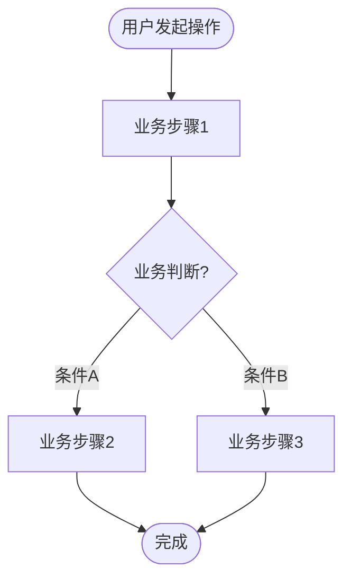
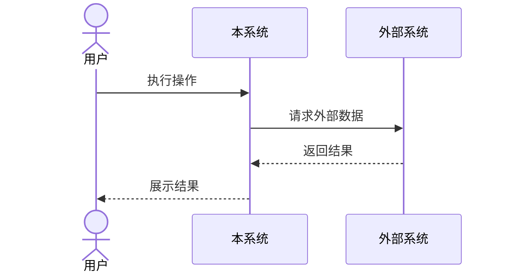
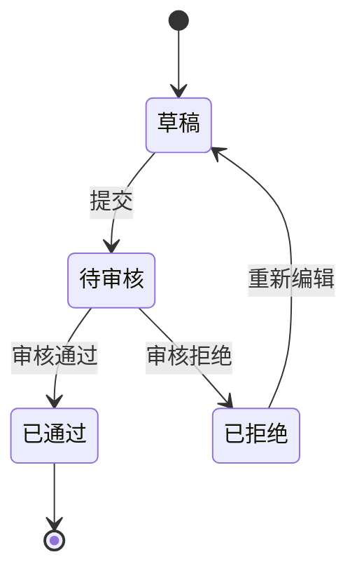

# ai-rd-team 头脑风暴记录

> 日期：2026-04-14 ~ 2026-04-15
> 状态：头脑风暴完成，待进入详细设计

---

## 一、项目愿景

构建一个**通用的、可定制的** AI Agent 数字人研发团队（ai-rd-team），覆盖完整软件研发流程：需求分析 → 架构设计 → 代码生成 → 代码检视 → 系统测试 → 构建部署。团队成员像真实人类团队一样自由沟通、讨论、协作，能真正完成一个软件需求的开发，后续可衔接发布。

---

## 二、核心原则

1. **无 API Key** — 完全基于宿主平台（如 CodeBuddy）的能力，不调用外部 LLM API
2. **真 Team 模式** — 每个成员是独立的 team member，不是 main/leader 的 subagent
3. **自主驱动** — 不是工作流编排，每个成员根据自己的角色和 Skills 自主判断该做什么、主动推进、自由沟通，像真正的人类团队
4. **自由沟通** — 成员间可自由对话、发起讨论、提出异议、达成共识
5. **动态任务拆分** — 根据需求自动拆分任务，每阶段可分配 1~N 个成员协作
6. **傻瓜化** — 用户不需要编排工作流，开箱即用，输入需求即自动运行
7. **像真实团队** — 角色有中文名和人设，方便代入理解
8. **通用可定制** — 角色、Skills、Rules、知识库均可配置，技术栈由架构师根据需求自主选择
9. **架构开放** — 适配器模式，第一期跑在 CodeBuddy，未来可适配其他平台

---

## 三、架构方案：四层架构（抽象编排层 + 适配器）

```
┌─────────────────────────────────────────────────────┐
│                   ai-rd-team 架构                     │
├─────────────────────────────────────────────────────┤
│                                                     │
│  ┌─────────────────────────────────────────┐        │
│  │  表现层 (Presentation)                   │        │
│  │  ┌─────────┐ ┌──────┐ ┌──────┐         │        │
│  │  │ Web 面板 │ │QQ Bot│ │微信Bot│  ...    │        │
│  │  └────┬────┘ └──┬───┘ └──┬───┘         │        │
│  └───────┼─────────┼────────┼──────────────┘        │
│          └─────────┼────────┘                       │
│                    ▼                                │
│  ┌─────────────────────────────────────────┐        │
│  │  服务层 (Service API)                    │        │
│  │  REST API — 统一的查看/控制接口           │        │
│  │  · 查询状态 · 查看消息 · 查看报告        │        │
│  │  · 启动/暂停 · 人类介入回复 · 配置管理    │        │
│  └──────────────────┬──────────────────────┘        │
│                     ▼                               │
│  ┌─────────────────────────────────────────┐        │
│  │  引擎层 (Engine) — 团队环境管理器        │        │
│  │  · 团队创建与成员生命周期管理             │        │
│  │  · 角色管理 (加载skills/配置/记忆)        │        │
│  │  · 共享工作空间 (制品/消息/状态)          │        │
│  │  · 长期记忆维护 (agent.d/memory.d)       │        │
│  │  · 资源监控与限制                        │        │
│  │  · 人类介入通道                          │        │
│  │  · 日志/Hook/断点                        │        │
│  └──────────────────┬──────────────────────┘        │
│                     ▼                               │
│  ┌─────────────────────────────────────────┐        │
│  │  适配层 (Adapter)                        │        │
│  │  BaseAdapter 统一接口                     │        │
│  │  ┌──────────┐ ┌────┐ ┌─────┐           │        │
│  │  │ CodeBuddy │ │Trae│ │Qoder│  ...      │        │
│  │  │ (第一期)   │ │    │ │     │           │        │
│  │  └──────────┘ └────┘ └─────┘           │        │
│  └─────────────────────────────────────────┘        │
└─────────────────────────────────────────────────────┘
```

### 各层职责

- **表现层**：只负责展示和交互。第一期 Web 面板，后续扩展 QQ/微信 Bot 远程查看和控制
- **服务层**：统一 REST API，所有表现层通过同一套 API 操作，新增渠道零改动引擎层
- **引擎层**：**团队环境管理器**（不是工作流调度器）。负责创建团队、启动成员、提供共享工作空间（制品/消息/状态）、维护长期记忆、监控资源限制、提供人类介入通道、记录日志和触发 Hook。**不决定谁先做什么、不按顺序调度阶段、不管理回退流程** — 这些由团队成员自主驱动
- **适配层**：定义统一的 `BaseAdapter` 接口，每个平台实现该接口即可接入。第一期实现 CodeBuddy Adapter，后续新增 Trae/Qoder 等只需新增适配器文件，**不改动引擎层和上层任何代码**

### 适配器接口标准（BaseAdapter）

所有平台适配器必须实现以下统一接口：

```python
class BaseAdapter:
    """AI 研发团队运行时适配器基类"""

    # ===== 团队管理 =====
    def create_team(self, team_name: str) -> str: ...
    def delete_team(self, team_name: str) -> None: ...

    # ===== 成员管理 =====
    def spawn_member(self, name: str, role: str, prompt: str,
                     skills: list, rules: list, context: str) -> str: ...
    def stop_member(self, name: str) -> None: ...
    def get_member_status(self, name: str) -> dict: ...

    # ===== 通信 =====
    def send_message(self, from_member: str, to_member: str,
                     content: str, msg_type: str) -> None: ...
    def broadcast(self, from_member: str, content: str) -> None: ...

    # ===== 文件操作 =====
    def read_file(self, path: str) -> str: ...
    def write_file(self, path: str, content: str) -> None: ...
    def list_dir(self, path: str) -> list: ...

    # ===== 代码操作 =====
    def search_code(self, pattern: str, path: str = None) -> list: ...
    def edit_file(self, path: str, old_str: str, new_str: str) -> None: ...

    # ===== 命令执行 =====
    def execute_command(self, command: str) -> dict: ...

    # ===== 能力查询 =====
    def get_capabilities(self) -> dict: ...
```

**各平台适配映射：**

| BaseAdapter 接口 | CodeBuddy | Trae | Qoder |
|-----------------|-----------|------|-------|
| `create_team()` | `team_create()` | TBD | TBD |
| `spawn_member()` | `Task(name=...)` | TBD | TBD |
| `send_message()` | `send_message()` | TBD | TBD |
| `read_file()` | `read_file()` | 类似 | 类似 |
| `write_file()` | `write_to_file()` | 类似 | 类似 |
| `execute_command()` | `execute_command()` | 类似 | 类似 |
| `search_code()` | `search_content()` | 类似 | 类似 |
| `edit_file()` | `replace_in_file()` | 类似 | 类似 |

**配置中选择适配器：**
```yaml
adapter:
  type: "codebuddy"       # codebuddy / trae / qoder
```

### Agent 实例组装架构

每个角色实例在运行时的构成：

```
┌────────────────────────────────────────────┐
│              Agent 实例（如：林前端）          │
├────────────────────────────────────────────┤
│                                            │
│  ┌──────────────────┐                      │
│  │ 角色 Prompt       │  ← 基础身份定义      │
│  │ (我是林前端，      │                      │
│  │  前端开发工程师)   │                      │
│  └──────────────────┘                      │
│                                            │
│  ┌──────────────────┐                      │
│  │ Persona（人设）    │  ← 个性/沟通风格    │
│  └──────────────────┘                      │
│                                            │
│  ┌──────────────────┐                      │
│  │ Rules            │  ← global + 角色专属  │
│  │ (编码规范/提交规范) │                      │
│  └──────────────────┘                      │
│                                            │
│  ┌──────────────────┐                      │
│  │ Skills 集合       │  ← 通用+角色+自定义  │
│  │ · communication   │                      │
│  │ · report-writing  │                      │
│  │ · coding          │                      │
│  │ · unit-testing    │                      │
│  │ · my-custom-skill │                      │
│  └──────────────────┘                      │
│                                            │
│  ┌──────────────────┐                      │
│  │ Knowledge Base    │  ← 知识库引用        │
│  │ (业务文档/API文档) │                      │
│  └──────────────────┘                      │
│                                            │
│  ┌──────────────────┐                      │
│  │ Context          │  ← 当前任务上下文     │
│  │ (技术方案/代码/    │                      │
│  │  检视报告等)       │                      │
│  └──────────────────┘                      │
│                                            │
└────────────────────────────────────────────┘
```

引擎层组装 Agent 的过程：
1. 读取 `config.yaml` 获取角色配置
2. 合并三层 skills（内置 → 全局自定义 → 工作区自定义）
3. 合并 rules（global rules + 角色 rules）
4. 加载知识库引用
5. 注入当前任务上下文（前序阶段的产出物）
6. 通过适配层创建 Agent 实例

---

## 四、团队角色设计：固定 + 可伸缩

### 固定角色（每个项目 1 个实例）

| 角色代号 | 中文姓名 | 职责 |
|---------|---------|------|
| `pm` | **周立项**（项目经理） | 接收需求，拆分阶段任务，协调团队，推进进度，汇总各阶段报告。是流程的发起者和推动者，但与其他成员平等沟通，不是 leader/main |
| `analyst` | **沈需求**（需求分析师） | 分析需求 + 业务知识库，输出需求规格说明书，处理架构师反馈的需求疑问，必要时请求人类澄清 |
| `architect` | **陈架构**（架构设计师） | 基于需求说明 + 已有代码 + 知识库，输出技术方案 + 模块划分，处理开发反馈，对需求不明确处反馈给需求分析师 |
| `devops` | **吴部署**（运维工程师） | 开发环境初始化、CI/CD 配置、构建部署、环境管理、发布衔接 |

### 可伸缩角色（按项目规模动态分配 1~N 个实例）

| 角色代号 | 中文姓名模板 | 职责 |
|---------|------------|------|
| `developer` | **林{专长}**（开发工程师） | 基于技术方案 + 已有代码，完成编码 + 单元测试 + 自测，处理检视意见，技术方案问题反馈给架构师。可按模块拆分：林前端、林后端、林数据等 |
| `reviewer` | **王{专长}**（代码检视工程师） | 结合技术方案 + 已有代码 + 知识库，检视代码质量/规范/安全，输出检视报告，反馈给开发工程师。大项目可并行检视不同模块 |
| `tester` | **赵{专长}**（测试工程师） | 结合技术方案 + 知识库，生成测试用例，执行测试，输出测试报告。可按测试类型拆分：功能测试、接口测试等 |

项目经理在看到架构方案后，决定启动几个开发/测试/检视实例，并为每个实例分配具体的中文名和职责范围。

### 角色可定制性

- **内置角色可禁用**：`roles.{role}.enabled: false`
- **可自定义全新角色**：如 DBA、安全工程师、技术写作等
- **每个角色有数字人人设**（Persona）：个性、沟通风格、头像、口头禅

---

## 五、决策机制：角色权威制

- 每个阶段有**主导角色**，对该阶段产出有最终决策权
- 其他角色可提意见，主导者**必须回应**（接受或给出理由拒绝）
- 僵持时**升级人类**介入裁决
- 避免 AI 之间无限讨论循环

---

## 六、讨论机制

### 三种讨论模式

**1. 评审会（正式）**
- 主导者展示产出 → 参与者逐一发表意见 → 逐条讨论达成一致 → 主导者修订 → 确认通过
- 最大轮次：3 轮（可配置），超过升级人类
- 适用于：需求评审、技术评审、测试评审、发布评审

**2. 异步检视（轻量）**
- 检视者输出意见 → 被检视者逐条回应（接受/反驳） → 未解决的争议升级讨论
- 适用于：Code Review

**3. 争议讨论（按需触发）**
- 任意成员发起 → 相关方参与 → 阶段主导者有最终决策权 → 僵持升级人类
- 适用于：检视争议、缺陷分诊

### 各阶段讨论安排

| 阶段产出 | 讨论类型 | 参与者 |
|---------|---------|--------|
| 需求规格说明书 | 评审会 | 全员 |
| 技术方案 | 技术评审 | 架构师+开发+检视+运维 |
| 任务拆分方案 | 排期讨论 | 项目经理+架构师+开发 |
| 代码实现（PR） | 异步检视 | 检视工程师+开发 |
| 检视争议 | 争议讨论（按需） | 检视+开发+架构师 |
| 测试方案 | 测试评审 | 测试+需求分析师+开发 |
| 测试缺陷 | 缺陷分诊（按需） | 测试+开发+架构师 |
| 部署方案 | 发布评审 | 运维+开发+项目经理 |

### 沟通协议

#### 消息类型
- `normal` — 普通消息
- `question` — 提问（期待回复）
- `proposal` — 提案（期待讨论）
- `decision` — 决策通知
- `handoff` — 工作交接
- `blocker` — 阻塞通知
- `status_update` — 状态更新
- `review_comment` — 检视意见
- `approval` — 批准
- `rejection` — 驳回

#### 消息优先级
- `urgent` — 紧急（如阻塞）
- `normal` — 普通
- `low` — 低优先级（如建议）

#### 消息格式（标准化）
```json
{
  "id": "msg-001",
  "from": "陈架构",
  "to": "林前端",
  "type": "question",
  "priority": "normal",
  "phase": "architecture_review",
  "content": "前端状态管理你倾向用 Vuex 还是 Pinia？",
  "reply_to": null,
  "timestamp": "2026-04-15T10:30:00",
  "acked": false
}
```

#### 消息响应规则
- 提问超时未回复则提醒（可配置超时时间）
- 阻塞消息自动升级
- 交接消息需要对方确认

---

## 七、团队协作模式（自主驱动，非工作流编排）

### 核心理念

**不是工作流编排，而是像人类团队一样自主协作。** 没有中央调度器按固定顺序推进阶段，而是每个成员根据自己的角色、Skills 和当前上下文，自主判断该做什么、主动推进。

| 维度 | ❌ 工作流模式 | ✅ 人类团队模式 |
|------|-------------|---------------|
| 驱动力 | 引擎调度 | 每个成员**自主驱动** |
| 阶段流转 | 引擎按顺序推进 | 成员完成后**主动通知**下一个 |
| 异常处理 | 预定义的回退规则 | 成员之间**自行协商** |
| 并行 | 引擎配置并行阶段 | 成员**自然并行**（各做各的） |
| 沟通 | 按固定协议发消息 | **自由对话**，像聊天一样 |
| 技术决策 | 配置文件指定 | 架构师**根据需求自主选择** |

### 启动策略

不是所有成员同时启动，而是像人类团队一样按需组建：

1. **引擎先启动项目经理**（唯一固定的发起人）
2. 项目经理读取需求，判断需要哪些角色
3. 项目经理请求引擎启动**需求分析师**（需求阶段必须）
4. 需求评审通过后，启动**架构设计师**
5. 技术评审通过后，项目经理根据模块划分，决定启动几个**开发/检视/测试**实例和**运维工程师**
6. 不需要的角色不启动（如纯前端项目不需要 DBA）

### 需求输入方式

支持多种输入方式：
- **文本描述**：直接在 Web 面板输入框输入
- **文件**：上传 .md / .docx / .pdf 需求文档
- **URL**：产品原型链接、竞品链接
- **混合**：文本 + 附件 + 参考链接

### 各成员启动后的自主行为

**周立项（项目经理）：**
1. 读取需求输入
2. 广播："各位，我们接到一个新需求"
3. 发消息给沈需求，附上需求描述
4. 等待需求分析完成后，发起需求评审
5. 评审通过后，通知陈架构开始设计
6. 看到技术方案后，与架构师和开发讨论任务拆分
7. 持续跟踪进度，协调问题，汇总报告

**沈需求（需求分析师）：**
1. 收到项目经理的需求 → 开始分析
2. 分析中有疑问 → 直接问项目经理或请求人类介入
3. 分析完成 → 主动发起："需求分析完成，大家来评审"
4. 收到评审意见 → 修订后再次发起评审

**陈架构（架构设计师）：**
1. 收到"可以开始设计" → 读取需求文档 + 已有代码
2. **根据需求自主选择技术栈**（参考团队能力清单 proficiency）
3. 设计过程中拉开发讨论可行性
4. 设计完成 → 主动发起技术评审
5. 收到开发反馈 → 调整方案

**林XX（开发工程师）：**
1. 收到任务分配 → 开始编码
2. 遇到技术方案问题 → 直接找架构师讨论
3. 编码完成 → 通知检视工程师
4. 收到检视意见 → 自行判断修复
5. 对检视意见有异议 → 直接与检视工程师讨论

**王XX（代码检视工程师）：**
1. 收到检视请求 → 开始检视
2. 检视完成 → 直接反馈给开发
3. 对开发的反驳意见 → 讨论达成共识

**赵XX（测试工程师）：**
1. 需求评审通过后 → 主动开始设计测试方案
2. 代码检视通过后 → 开始执行测试
3. 发现缺陷 → 直接告诉开发
4. 开发修复后 → 回归验证

**吴部署（运维工程师）：**
1. 技术评审通过后 → 主动开始环境初始化
2. 测试通过后 → 主动规划部署方案
3. 发起发布评审 → 执行部署

### 典型协作场景（而非固定流程）

```
周立项 → 沈需求："新需求来了，帮忙分析下"
沈需求 → 全员："需求分析好了，大家评审"
  [全员评审讨论]
陈架构 → 周立项："评审通过了，我开始做架构设计"
陈架构 → 林前端："前端部分你看看这样设计行不行？"
林前端 → 陈架构："小程序端建议用 UniApp，方便同时出 H5"
陈架构 → 全员："技术方案好了，来评审"
  [技术评审讨论]
吴部署 → 周立项："我先把开发环境搭起来"
赵测试 → 沈需求："测试方案写好了，你帮看看覆盖全不全"
周立项 → 全员："任务分配好了，开干吧"
林前端 → 王前端："PC 端页面写好了，帮看看"
林后端 → 陈架构："这个接口设计有个问题想讨论下"
赵功能 → 林后端："BUG-003 修了吗？我好回归"
  ...
```

### 关键机制
- **自主驱动**：每个成员根据角色 Skills 自行决定下一步
- **自由沟通**：成员间直接对话，不经过调度器
- **自然并行**：不需要配置并行，成员各做各的自然并行（如测试方案和环境初始化同时进行）
- **自行协商**：遇到问题直接找相关方讨论，不是"触发回退流程"
- **迭代上限**：资源限制仍然有效（最大迭代次数等），但不是"流程规则"而是"安全网"
- **每个阶段完成输出工作报告**：由成员主动撰写

### 并行开发协调
- 架构师在模块划分时明确**接口契约**（module-split.md 中的接口契约表）
- Go+Kratos 使用 protobuf 定义 API，天然就是接口契约，前端可据此先行开发
- 每个开发成员在自己的 **feature 分支**上工作（`ai-rd/{member}-{module}`），最后由运维合并
- 开发成员工作前在 agent.d 中声明正在编辑的文件范围，其他成员可见

### 成员健康监控
引擎层监控每个成员的活跃状态，像人类团队中项目经理关注成员状态：
- **空闲超时**：成员超过一定时间无消息/无产出 → 项目经理主动询问
- **卡住检测**：同一任务长时间无进展 → 通知项目经理介入
- **错误重试**：成员执行出错最多重试 N 次，超过则通知项目经理
- **项目经理介入**：项目经理可以重新分配任务、请求人类帮助、或调整方案

### 引擎层的角色（团队环境管理器）

```
引擎层做什么：
  ✅ 创建团队、启动成员、管理生命周期
  ✅ 提供共享工作空间（制品存储、消息系统、状态面板）
  ✅ 维护长期记忆（agent.d、memory.d、decisions）
  ✅ 监控资源限制（超时、超迭代 → 提醒成员或人类）
  ✅ 提供人类介入通道
  ✅ 记录日志、触发 Hook
  ✅ 管理断点和恢复

引擎层不做什么：
  ❌ 不按顺序调度阶段
  ❌ 不决定"下一步该谁做什么"
  ❌ 不管理固定的回退流程
  ❌ 不充当中央控制器
```

---

## 八、人工介入模式

### 三种运行模式

```yaml
interaction_mode: "auto"  # auto / supervised / manual
```

| 行为 | `auto` | `supervised` | `manual` |
|------|--------|-------------|----------|
| 阶段自动流转 | ✅ 自动 | ❌ 每阶段暂停 | ❌ 每步暂停 |
| 评审讨论 | 自动进行 | 自动进行 | 需人工确认 |
| 修复迭代 | 自动进行 | 自动进行 | 需人工确认 |
| 人工介入触发 | 仅异常/僵持 | 每阶段结束 + 异常 | 每步 |
| 适用场景 | 简单需求/演示 | **日常开发（推荐）** | 关键项目/首次使用 |

### 混合模式

全局模式 + 单阶段 `pause_after` 覆盖，实现灵活控制：
- 例：全自动但架构评审后必须人工确认
- 例：监督模式但编码阶段不暂停

### 暂停时的人工交互选项

| 选项 | 说明 |
|------|------|
| **继续** | 确认当前阶段产出，进入下一阶段 |
| **补充** | 对当前产出补充要求，角色据此修订后再次暂停等待确认 |
| **修改** | 人工直接修改制品文件，修改完后继续 |
| **打回重做** | 当前阶段产出不合格，从头重做该阶段 |
| **回退** | 回退到指定阶段重新开始 |
| **终止** | 终止整个项目流程 |

---

## 九、Skills 体系：三层架构

```
┌─────────────────────────────────────┐
│  用户自定义 Skills（最高优先级）       │
├─────────────────────────────────────┤
│  角色专属 Skills（中优先级）          │
├─────────────────────────────────────┤
│  通用 Skills（基础层）               │
└─────────────────────────────────────┘
```

### 通用 Skills（所有角色共享）
- `report-writing` — 撰写工作报告
- `knowledge-base` — 查询业务知识库
- `code-reading` — 阅读理解已有代码
- `communication` — 团队沟通协议（如何发消息、发起讨论、表达异议）
- `escalation` — 升级机制（何时请求人类介入）

### 角色专属 Skills（内置默认）
- 项目经理：`task-decomposition`、`progress-tracking`、`report-aggregation`
- 需求分析师：`requirement-analysis`、`user-story-writing`
- 架构设计师：`architecture-design`、`tech-stack-selection`
- 开发工程师：`coding`、`unit-testing`、`self-testing`
- 检视工程师：`code-review`、`security-review`
- 测试工程师：`test-case-design`、`test-execution`
- 运维工程师：`ci-cd`、`deployment`、`env-setup`

### 默认技术栈 Skills（Go+Kratos+Vue+小程序）

内置一套完整的技术栈 Skills，架构师根据需求自动选择加载：

| 角色 | Skill 文件 | 内容 |
|------|-----------|------|
| 架构师 | `tech-stack-go-kratos.md` | Kratos 项目结构、分层规范、关键约定 |
| 架构师 | `tech-stack-vue3.md` | Vue3 项目结构、组件规范、状态管理 |
| 架构师 | `tech-stack-wechat-mp.md` | 微信小程序架构、目录结构、API 规范 |
| 架构师 | `tech-stack-uniapp.md` | UniApp 跨端架构、条件编译 |
| 开发 | `coding-go-kratos.md` | Go+Kratos 编码规范、最佳实践 |
| 开发 | `coding-vue3.md` | Vue3 编码规范、组合式 API |
| 开发 | `coding-wechat-mp.md` | 小程序编码规范 |
| 开发 | `unit-testing-go.md` | Go 单元测试（testing + testify） |
| 开发 | `unit-testing-vue.md` | Vue 单元测试（Vitest + Vue Test Utils） |
| 检视 | `code-review-go.md` | Go 代码检视规则 |
| 检视 | `code-review-vue.md` | Vue 代码检视规则 |
| 运维 | `env-setup-go-kratos.md` | Go+Kratos 环境初始化 |
| 运维 | `env-setup-vue3.md` | Vue3 项目初始化（Vite） |
| 运维 | `env-setup-wechat-mp.md` | 小程序开发环境初始化 |

**架构师自动选择逻辑（在 `tech-stack-selection` skill 中）：**
- 需求提到 PC/Web → 加载 Vue3 相关 skills
- 需求提到微信小程序 → 加载 wechat-mp 相关 skills
- 需求同时需要 PC + 小程序 → 考虑 UniApp 或分别开发，由架构师决策
- 后端默认加载 Go+Kratos（除非需求明确不适合）
- 用户可通过自定义 skills 替换为任何技术栈

### 用户自定义 Skills 覆盖规则
- 工作区 `.ai-rd-team/skills/` > 用户主目录 `~/.ai-rd-team/skills/` > 内置默认
- 可按角色覆盖：`.ai-rd-team/skills/developer/my-coding-style.md`
- 也可全局覆盖：`.ai-rd-team/skills/common/my-report-template.md`
- 同角色同名 skill 文件按优先级覆盖，不同名的合并（都生效）

---

## 十、双层配置体系

### 目录结构

```
~/.ai-rd-team/                          ← 用户级（全局默认）
  config.yaml                           ← 全局配置
  skills/
    common/                             ← 通用 skills
      report-writing.md
      knowledge-base.md
      code-reading.md
      communication.md
      escalation.md
    pm/                                 ← 项目经理专属
      task-decomposition.md
      progress-tracking.md
      report-aggregation.md
    analyst/
      requirement-analysis.md
      user-story-writing.md
    architect/
      architecture-design.md
      tech-stack-selection.md
    developer/
      coding.md
      unit-testing.md
      self-testing.md
    reviewer/
      code-review.md
      security-review.md
    tester/
      test-case-design.md
      test-execution.md
    devops/
      ci-cd.md
      deployment.md
      env-setup.md
  templates/                            ← 报告模板等
    requirement-spec.md
    tech-design.md
    review-report.md
    test-report.md
    phase-report.md
  knowledge-base/                       ← 全局知识库
  hooks/                                ← 全局钩子脚本

<workspace>/.ai-rd-team/                ← 工作区级（项目专属，优先级更高）
  config.yaml                           ← 项目配置（覆盖全局）
  skills/                               ← 项目自定义 skills
  templates/
  knowledge-base/                       ← 项目知识库
  hooks/                                ← 项目钩子脚本
  agent.d/                              ← 长期记忆：角色记忆（启动时加载）
    team.md                             ←   团队级共识
    project.md                          ←   项目要点
    roles/                              ←   各角色工作记忆
  memory.d/                             ← 长期记忆：事实记忆（按需检索）
    technical/
    domain/
    lessons/
  decisions/                            ← 长期记忆：决策记录（ADR 格式）
  runtime/                              ← 运行时数据
    projects/
      {project-id}/
        meta.yaml                       ← 项目元信息
        checkpoint.yaml                 ← 断点信息
        status.json                     ← 成员状态
        messages.json                   ← 沟通记录
        artifacts/                      ← 阶段制品
        logs/                           ← 日志
        change-requests/                ← 变更请求
      current -> {project-id}           ← 软链接指向当前项目
    archives/                           ← 历史迭代归档
```

### 合并规则

| 优先级 | 来源 | 说明 |
|--------|------|------|
| 最高 | `<workspace>/.ai-rd-team/` | 项目专属配置，覆盖全局 |
| 次高 | `~/.ai-rd-team/` | 用户全局默认 |
| 最低 | 内置默认 | ai-rd-team 自带的默认 skills 和配置 |

- `config.yaml`：字段级合并，工作区同名字段覆盖全局
- `skills/`：同角色同名 skill 文件按优先级覆盖，不同名的合并
- `templates/`：同名覆盖，不同名合并
- Web 设置页面编辑时让用户选择保存到全局还是工作区

---

## 十一、完整配置文件结构（config.yaml）

```yaml
# ai-rd-team 配置文件
# 同名配置项：工作区 > 用户主目录 > 内置默认
config_version: "1.0"                     # 配置文件版本（升级时用于自动迁移）

# ============ 项目信息 ============
project:
  name: ""                              # 项目名称
  description: ""                       # 项目描述
  language: "zh-CN"                     # 团队沟通和文档输出语言
  type: "new"                           # new / incremental
  existing_codebase:                    # 增量模式下的已有代码配置
    path: "."
    entry_points: []
    tech_stack: ""
  history:                              # 历史迭代引用
    previous_iterations: []

# ============ 全局 Rules ============
rules:
  global:
    - "代码注释使用中文"
    - "commit message 使用 conventional commits 格式"
    - "所有公开接口必须有文档注释"
  coding:
    - "单个函数不超过 80 行"
    - "单个文件不超过 500 行"
  review:
    - "检视必须覆盖：正确性、安全性、性能、可维护性"
  testing:
    - "单元测试覆盖率不低于 80%"

# ============ 知识库配置 ============
knowledge_base:
  paths:
    - "./docs"
    - "./knowledge-base"
  external:
    - type: "url"
      url: ""

# ============ 角色配置 ============
roles:
  pm:
    enabled: true
    name: "周立项"
    title: "项目经理"
    persona:
      personality: "沉稳有条理，善于协调各方，推动进度"
      communication_style: "简洁明了，重点突出"
      avatar: "pm.png"
      catchphrase: "计划赶不上变化，但没有计划万万不行"
    skills:
      - "task-decomposition"
      - "progress-tracking"
      - "report-aggregation"
    rules:
      - "任务拆分粒度：每个任务不超过 4 小时工作量"
      - "每个阶段结束必须输出阶段报告"
    context: ""

  analyst:
    enabled: true
    name: "沈需求"
    title: "需求分析师"
    persona:
      personality: "细致入微，善于倾听，追求需求的完整性和准确性"
      communication_style: "喜欢追问细节，确保没有遗漏"
      avatar: "analyst.png"
      catchphrase: "需求不明确是万恶之源"
    skills:
      - "requirement-analysis"
      - "user-story-writing"
    rules:
      - "需求必须包含验收标准"
      - "非功能需求必须量化"
    context: ""

  architect:
    enabled: true
    name: "陈架构"
    title: "架构设计师"
    persona:
      personality: "严谨务实，追求简洁优雅的设计，不喜欢过度工程化"
      communication_style: "逻辑清晰，喜欢用类比解释复杂概念"
      avatar: "architect.png"
      catchphrase: "简单才是终极的复杂"
    skills:
      - "architecture-design"
      - "tech-stack-selection"
    rules:
      - "架构决策必须给出理由和替代方案对比"
      - "接口设计必须考虑向后兼容"
    context: ""

  developer:
    enabled: true
    name_template: "林{speciality}"
    title: "开发工程师"
    persona:
      personality: "务实高效，注重代码质量，喜欢写简洁的代码"
      communication_style: "直接，用代码说话"
      avatar: "developer.png"
      catchphrase: "Talk is cheap, show me the code"
    skills:
      - "coding"
      - "unit-testing"
      - "self-testing"
    rules:
      - "提交代码前必须通过本地单元测试"
      - "每个公开函数必须有单元测试"
    context: ""
    scalable: true
    max_instances: 5

  reviewer:
    enabled: true
    name_template: "王{speciality}"
    title: "代码检视工程师"
    persona:
      personality: "一丝不苟，眼光犀利，但也懂得区分重要问题和风格偏好"
      communication_style: "直指问题，同时给出改进建议"
      avatar: "reviewer.png"
      catchphrase: "好代码是改出来的"
    skills:
      - "code-review"
      - "security-review"
    rules:
      - "检视意见必须分级：阻塞/建议/可选"
      - "安全相关问题必须标记为阻塞级别"
    context: ""
    scalable: true
    max_instances: 3

  tester:
    enabled: true
    name_template: "赵{speciality}"
    title: "测试工程师"
    persona:
      personality: "耐心细致，有破坏欲，善于发现边界条件"
      communication_style: "用数据和事实说话，缺陷报告条理清晰"
      avatar: "tester.png"
      catchphrase: "没有测不出的 bug，只有不够细的用例"
    skills:
      - "test-case-design"
      - "test-execution"
    rules:
      - "测试用例必须覆盖正向和异常场景"
      - "缺陷报告必须包含复现步骤"
    context: ""
    scalable: true
    max_instances: 3

  devops:
    enabled: true
    name: "吴部署"
    title: "运维工程师"
    persona:
      personality: "稳重可靠，对环境问题有极强的排查能力"
      communication_style: "关注细节，强调可回滚和容灾"
      avatar: "devops.png"
      catchphrase: "上线不是结束，而是另一个开始"
    skills:
      - "ci-cd"
      - "deployment"
      - "env-setup"
    rules:
      - "部署必须有回滚方案"
      - "环境变量不能硬编码"
    context: ""

  # 用户可自定义新角色
  # dba:
  #   enabled: true
  #   name: "钱数据"
  #   title: "数据库工程师"
  #   ...

# ============ 通用 Skills ============
common_skills:
  - "report-writing"
  - "knowledge-base"
  - "code-reading"
  - "communication"
  - "escalation"

# ============ 技术栈能力清单 ============
# 告诉团队"你们会什么"，架构师根据需求自主选择最合适的
tech_stack:
  proficiency:
    backend:
      - name: "go-kratos"
        level: "expert"
        description: "Go + Kratos v2 微服务框架"
      # - name: "python-flask"
      #   level: "intermediate"
    frontend:
      - name: "vue3"
        level: "expert"
        description: "Vue3 + Vite + Element Plus / Naive UI"
      - name: "wechat-miniprogram"
        level: "expert"
        description: "微信小程序原生开发"
      - name: "uniapp"
        level: "intermediate"
        description: "UniApp 跨端开发（小程序+H5+App）"
    database:
      - name: "mysql"
        level: "expert"
      - name: "redis"
        level: "expert"
      - name: "sqlite"
        level: "intermediate"
  preferences:                          # 偏好（非强制，架构师可根据需求覆盖）
    backend: "go-kratos"
    frontend: "vue3"
    database: "mysql"

# ============ 适配器选择 ============
adapter:
  type: "codebuddy"                     # codebuddy / trae / qoder

# ============ 环境约束 ============
environment:
  deployment:
    targets: ["docker"]                 # docker / k8s / bare-metal / serverless
    cloud: "none"                       # aliyun / tencent / aws / none
  infrastructure:
    existing_services: []               # 已有服务（如已有用户中心 API）
    middleware: ["mysql", "redis"]       # 已有中间件
  constraints:
    budget: "open-source-only"          # open-source-only / commercial-ok
    compliance: []                      # 合规要求

# ============ 团队运行参数 ============
team:
  # 人工介入模式
  interaction_mode: "supervised"        # auto / supervised / manual
  
  # 资源安全网（不是流程规则，是防失控的安全网）
  safety_limits:
    review_max_rounds: 3                # 单次评审最大轮次
    fix_max_iterations: 3               # 检视/测试修复最大迭代
    escalation_timeout_minutes: 30      # 人类介入超时

  # 成员健康监控
  health_check:
    idle_timeout_minutes: 15            # 成员空闲超时 → 项目经理询问
    stuck_threshold_minutes: 30         # 卡住检测阈值 → 通知项目经理
    max_retry_on_error: 3               # 出错最大重试次数
    on_member_stuck: "pm_intervene"     # pm_intervene / human_escalate / restart

# ============ 质量门禁 ============
quality_gates:
  code_review:
    max_blocker_issues: 0
    max_major_issues: 3
    require_all_blockers_fixed: true
  testing:
    min_pass_rate: 0.95
    max_blocker_bugs: 0
    max_critical_bugs: 0
    require_all_cases_executed: true
  unit_testing:
    min_coverage: 0.80
    require_all_pass: true
  deployment:
    require_all_tests_pass: true
    require_review_approved: true
    require_no_open_blockers: true

# ============ 资源限制 ============
resource_limits:
  max_total_time_minutes: 480
  max_phase_time_minutes: 120
  max_concurrent_members: 8
  max_total_review_rounds: 10
  max_total_fix_iterations: 15
  on_limit_exceeded: "pause"            # pause / terminate / notify_human

# ============ 沟通配置 ============
communication:
  response_rules:
    question_timeout_minutes: 5
    blocker_auto_escalate: true
    require_ack_for_handoff: true

# ============ 通知配置 ============
notifications:
  channels:
    - type: "web"
      enabled: true
    - type: "webhook"
      enabled: false
      url: ""
  events:
    phase_completed: true
    human_input_required: true
    review_started: true
    bug_found: true
    project_completed: true
    error_occurred: true

# ============ 日志配置 ============
logging:
  level: "info"                         # debug / info / warn / error
  max_file_size_mb: 50
  max_files: 10
  log_member_prompts: false
  log_member_responses: true

# ============ 钩子/插件 ============
hooks:
  on_phase_start: []
  on_phase_complete: []
  on_review_complete: []
  on_project_complete: []
  on_human_escalation: []
  on_error: []

# ============ 外部工具集成 ============
tools:
  git:
    enabled: true
    auto_commit: true
    commit_convention: "conventional"
    branch_strategy: "feature"
    branch_prefix: "ai-rd/"
  package_manager: "auto"
  formatter:
    enabled: true
    auto_format_on_save: true
  linter:
    enabled: true
    fail_on_error: true
  test_runner: "auto"

# ============ Web 监控配置 ============
web:
  host: "127.0.0.1"
  port: 8686
  auto_open_browser: true
  theme: "light"

# ============ 安全约束 ============
security:
  allowed_commands:                       # 允许执行的命令模式（默认宽松）
    - "go *"
    - "npm *"
    - "yarn *"
    - "pip *"
    - "git *"
    - "make *"
    - "docker *"
    - "python *"
    - "node *"
  blocked_commands:                       # 禁止执行的命令
    - "rm -rf /"
    - "sudo *"
    - "curl * | sh"
    - "wget * | sh"
  file_access:
    writable_paths:                       # 可写目录（默认只能写工作区内）
      - "${WORKSPACE}/"
      - "${HOME}/.ai-rd-team/"
    readonly_paths: []                    # 只读目录
```

---

## 十二、阶段制品文件格式

### 制品文件存放位置

```
runtime/projects/{project-id}/artifacts/
  01-requirement/
    spec-requirement.md               ← 需求规格说明书
    report-requirement.md             ← 需求分析工作报告
  02-architecture/
    spec-tech-design.md               ← 技术方案
    spec-module-split.md              ← 模块划分说明
    report-architecture.md            ← 架构设计工作报告
  03-env-init/
    spec-env-init.md                  ← 环境初始化报告
    report-env-init.md                ← 环境初始化工作报告
  04-task-split/
    data-task-list.yaml               ← 任务清单（结构化）
    report-task-split.md              ← 任务拆分工作报告
  05-test-design/
    spec-test-plan.md                 ← 测试方案
    data-test-cases.yaml              ← 测试用例（结构化）
    report-test-design.md             ← 测试设计工作报告
  06-coding/
    modules/{module-id}/
      spec-code-summary.md            ← 模块编码说明
      result-unit-test.md             ← 单元测试结果
    report-coding.md                  ← 编码阶段工作报告
  07-code-review/
    modules/{module-id}/
      result-review.md                ← 检视报告
      log-review-fix.md               ← 检视修复记录
    report-code-review.md             ← 代码检视工作报告
  08-testing/
    result-test.md                    ← 测试执行结果
    data-bug-list.yaml                ← 缺陷清单（结构化）
    log-bug-fix.md                    ← 缺陷修复记录
    report-testing.md                 ← 系统测试工作报告
  09-deployment/
    spec-deploy-plan.md               ← 部署方案
    result-deploy.md                  ← 部署结果
    report-deployment.md              ← 部署阶段工作报告
  report-final.md                     ← 项目总结报告
```

### 制品文件命名规范

```
目录名：{两位序号}-{阶段英文名}/
文件名：{类型}-{描述}.{md|yaml}
  - 全小写，用连字符分隔
  - 工作报告：report-{阶段英文名}.md
  - 结构化数据：.yaml
  - 文档：.md
模块级：modules/{module-id}/ 子目录
```

### 制品文件存放目录

```
runtime/projects/{project-id}/artifacts/
│
├── 01-requirement/                         ← 需求分析阶段
│   ├── spec-requirement.md                 ← 需求规格说明书
│   └── report-requirement.md               ← 需求分析工作报告
│
├── 02-architecture/                        ← 架构设计阶段
│   ├── spec-tech-design.md                 ← 技术方案
│   ├── spec-module-split.md                ← 模块划分说明
│   └── report-architecture.md              ← 架构设计工作报告
│
├── 03-env-init/                            ← 环境初始化阶段
│   ├── spec-env-init.md                    ← 环境初始化报告
│   └── report-env-init.md                  ← 环境初始化工作报告
│
├── 04-task-split/                          ← 任务拆分阶段
│   ├── data-task-list.yaml                 ← 任务清单（结构化）
│   └── report-task-split.md                ← 任务拆分工作报告
│
├── 05-test-design/                         ← 测试设计阶段
│   ├── spec-test-plan.md                   ← 测试方案
│   ├── data-test-cases.yaml                ← 测试用例（结构化）
│   └── report-test-design.md               ← 测试设计工作报告
│
├── 06-coding/                              ← 编码阶段
│   ├── modules/
│   │   ├── {module-id}/
│   │   │   ├── spec-code-summary.md        ← 模块编码说明
│   │   │   └── result-unit-test.md         ← 单元测试结果
│   │   └── ...
│   └── report-coding.md                    ← 编码阶段工作报告
│
├── 07-code-review/                         ← 代码检视阶段
│   ├── modules/
│   │   ├── {module-id}/
│   │   │   ├── result-review.md            ← 检视报告
│   │   │   └── log-review-fix.md           ← 检视修复记录
│   │   └── ...
│   └── report-code-review.md               ← 代码检视工作报告
│
├── 08-testing/                             ← 系统测试阶段
│   ├── result-test.md                      ← 测试执行结果
│   ├── data-bug-list.yaml                  ← 缺陷清单（结构化）
│   ├── log-bug-fix.md                      ← 缺陷修复记录
│   └── report-testing.md                   ← 系统测试工作报告
│
├── 09-deployment/                          ← 构建部署阶段
│   ├── spec-deploy-plan.md                 ← 部署方案
│   ├── result-deploy.md                    ← 部署执行结果
│   └── report-deployment.md                ← 部署阶段工作报告
│
└── report-final.md                         ← 项目总结报告（项目经理汇总）
└── delivery-checklist.md                   ← 交付清单（代码/文档产物、启动/部署说明）
```

### 制品文件完整清单

| 阶段 | 文件名 | 类型前缀 | 格式 | 编写人 | 说明 |
|------|--------|---------|------|--------|------|
| **01-requirement** | `spec-requirement.md` | spec | Markdown | 沈需求 | 需求规格说明书（含业务背景、用例图、业务流程图、术语表等） |
| | `report-requirement.md` | report | Markdown | 沈需求 | 需求分析阶段工作报告 |
| **02-architecture** | `spec-tech-design.md` | spec | Markdown | 陈架构 | 技术方案（含用例图、时序图、活动图、类图、ER图、DDL SQL、Redis Key、接口设计等） |
| | `spec-module-split.md` | spec | Markdown | 陈架构 | 模块划分说明（含依赖图、开发顺序、接口契约、人员分配建议） |
| | `report-architecture.md` | report | Markdown | 陈架构 | 架构设计阶段工作报告 |
| **03-env-init** | `spec-env-init.md` | spec | Markdown | 吴部署 | 环境初始化报告（技术栈版本、依赖、构建、Git、环境验证） |
| | `report-env-init.md` | report | Markdown | 吴部署 | 环境初始化阶段工作报告 |
| **04-task-split** | `data-task-list.yaml` | data | YAML | 周立项 | 任务清单（结构化，含任务ID、模块、分配、优先级、依赖、状态） |
| | `report-task-split.md` | report | Markdown | 周立项 | 任务拆分阶段工作报告 |
| **05-test-design** | `spec-test-plan.md` | spec | Markdown | 赵测试 | 测试方案（范围、策略、环境、通过标准） |
| | `data-test-cases.yaml` | data | YAML | 赵测试 | 测试用例（结构化，含步骤、预期、状态） |
| | `report-test-design.md` | report | Markdown | 赵测试 | 测试设计阶段工作报告 |
| **06-coding** | `modules/{id}/spec-code-summary.md` | spec | Markdown | 林XX | 模块编码说明（实现概述、文件清单、核心逻辑、与方案偏差） |
| | `modules/{id}/result-unit-test.md` | result | Markdown | 林XX | 单元测试结果（覆盖率、通过率、失败用例） |
| | `report-coding.md` | report | Markdown | 周立项 | 编码阶段工作报告（汇总所有模块进展） |
| **07-code-review** | `modules/{id}/result-review.md` | result | Markdown | 王XX | 检视报告（结论、阻塞/建议/可选问题明细） |
| | `modules/{id}/log-review-fix.md` | log | Markdown | 林XX | 检视修复记录（每轮修复明细、验证结果） |
| | `report-code-review.md` | report | Markdown | 周立项 | 代码检视阶段工作报告 |
| **08-testing** | `result-test.md` | result | Markdown | 赵XX | 测试执行结果（通过率、缺陷统计、质量门禁检查） |
| | `data-bug-list.yaml` | data | YAML | 赵XX | 缺陷清单（结构化，含严重度、状态、复现步骤） |
| | `log-bug-fix.md` | log | Markdown | 林XX | 缺陷修复记录（每轮修复明细、验证结果） |
| | `report-testing.md` | report | Markdown | 赵XX | 系统测试阶段工作报告 |
| **09-deployment** | `spec-deploy-plan.md` | spec | Markdown | 吴部署 | 部署方案（环境、步骤、SQL、回滚方案、监控） |
| | `result-deploy.md` | result | Markdown | 吴部署 | 部署执行结果（步骤记录、验证结果、产物地址） |
| | `report-deployment.md` | report | Markdown | 吴部署 | 部署阶段工作报告 |
| **根目录** | `report-final.md` | report | Markdown | 周立项 | 项目总结报告（需求完成情况、耗时统计、质量数据、追踪矩阵、经验总结） |
| **根目录** | `delivery-checklist.md` | spec | Markdown | 周立项 | 交付清单（代码产物路径、文档产物路径、如何运行、如何部署） |

### 文件类型前缀说明

| 前缀 | 含义 | 说明 |
|------|------|------|
| `spec-` | 规格/方案文档 | 正式的交付文档，需要评审 |
| `data-` | 结构化数据 | YAML 格式，供引擎或工具解析 |
| `result-` | 执行结果 | 测试结果、检视结果、部署结果等 |
| `log-` | 过程记录 | 修复记录、迭代记录等 |
| `report-` | 工作报告 | 每阶段的工作报告，通用格式 |

---

### 各制品文件格式定义

#### 1. 需求规格说明书（requirement-spec.md）

```markdown
# 需求规格说明书

## 元信息
- 项目名称：{project_name}
- 文档版本：{version}
- 编写人：沈需求（需求分析师）
- 创建时间：{created_at}
- 最后修改：{updated_at}
- 状态：草稿 / 评审中 / 已通过

## 1. 背景与目标
### 1.1 业务背景
{行业/业务领域背景，本系统要解决的业务问题}
### 1.2 项目背景
{项目发起的原因、契机，如果是增量需求则说明前序版本情况}
### 1.3 项目目标
{本次项目要达成的目标，可量化}
### 1.4 目标用户与角色
| 用户角色 | 描述 | 核心诉求 | 使用频率 | 权限范围 |
|---------|------|---------|---------|---------|
| {角色名} | {角色描述} | {核心诉求} | {高/中/低} | {权限说明} |
### 1.5 相关系统
| 系统名称 | 关系 | 交互方式 | 说明 |
|---------|------|---------|------|
| {系统名} | 上游/下游/平级 | API/消息/文件 | {说明本系统与其的关系} |

## 2. 功能需求
### 2.1 功能清单
| 编号 | 功能名称 | 优先级 | 描述 |
|------|---------|--------|------|
| FR-001 | {名称} | P0/P1/P2 | {描述} |

### 2.2 功能详述
#### FR-001：{功能名称}
- **描述**：{详细描述}
- **用户故事**：作为{角色}，我希望{行为}，以便{价值}
- **验收标准**：
  - [ ] {标准1}
- **业务规则**：
- **原型/交互说明**：
- **业务流程**：{如果该功能涉及多步骤交互，给出业务流程描述}

## 3. 业务流程与图表
> 本章从业务视角描述系统如何运转，参与者为用户/业务角色/外部系统（非技术组件）

### 3.1 业务流程总览图
{Mermaid 流程图，展示核心业务从开始到结束的全貌}


### 3.2 业务时序图
{Mermaid 时序图，展示用户与系统、外部系统之间的交互顺序}


### 3.3 业务状态图（如涉及状态流转）
{Mermaid 状态图，展示核心业务对象的状态变迁}


### 3.4 用例图
{Mermaid 图，展示各用户角色与系统功能的关系}

> 注意：这里的图表都是**业务视角**，描述"做什么"而非"怎么做"。
> 技术实现层面的时序图、类图等在技术方案（tech-design.md）中描述。

## 4. 非功能需求
| 编号 | 类型 | 描述 | 量化指标 |
|------|------|------|---------|
| NFR-001 | 性能 | {描述} | {如：响应时间<200ms} |

## 5. 数据需求
### 5.1 核心数据实体
### 5.2 数据量预估

## 6. 接口需求
{与外部系统的接口需求，引用 §1.5 相关系统}

## 7. 约束与假设
### 7.1 技术约束
### 7.2 业务约束
### 7.3 假设

## 8. 术语与名词解释
| 术语/缩写 | 英文（如有） | 定义 | 所属领域 | 备注 |
|----------|------------|------|---------|------|
| {术语} | {English} | {定义} | 业务/技术 | {备注} |

## 9. 评审记录
| 轮次 | 日期 | 参与者 | 主要意见 | 处理结果 |
|------|------|--------|---------|---------|
```

### 2. 技术方案（tech-design.md）

```markdown
# 技术方案

## 元信息
- 项目名称：{project_name}
- 文档版本：{version}
- 编写人：陈架构（架构设计师）
- 创建时间：{created_at}
- 最后修改：{updated_at}
- 状态：草稿 / 评审中 / 已通过

## 1. 概述
### 1.1 业务背景
{引用需求规格说明书 §1.1~§1.2，概述业务场景和项目背景，不重复全文}
### 1.2 需求摘要
{关联的需求规格说明书核心内容摘要}
### 1.3 设计目标
### 1.4 设计约束

## 2. 术语与命名对照
| 业务术语 | 技术命名 | 数据库表/字段 | API 路径/参数 | 说明 |
|---------|---------|-------------|-------------|------|
| {如：书签} | Bookmark | bookmark | /api/v1/bookmarks | {说明} |
| {如：分类} | Category | category | /api/v1/categories | {说明} |
> 此表确保业务概念、代码命名、数据库命名、API 命名四者一致

## 3. 技术选型
| 层次 | 技术 | 版本 | 选型理由 | 替代方案 |
|------|------|------|---------|---------|

## 4. 系统架构
### 4.1 整体架构图
### 4.2 用例图（Mermaid）
### 4.3 分层说明

## 5. 模块设计
### 5.1 模块变更清单
| 模块编号 | 模块名称 | 变更类型 | 职责 | 依赖模块 | 影响范围 |
|---------|---------|---------|------|---------|---------|
> 变更类型：**新增** / **修改** / **不变（依赖）**
> 修改类型必须说明改动内容和影响范围

### 5.2 模块依赖关系图（Mermaid）
### 5.3 类图（Mermaid）
### 5.4 模块详细设计
#### M-001：{模块名称}【新增/修改】
- **职责**
- **对外接口**
- **内部核心逻辑**
- **错误处理**
- （修改类型额外包含：原有职责、变更内容、变更理由、影响分析、向后兼容）

## 6. 核心流程设计
### 6.1 时序图（Mermaid）
### 6.2 活动图（Mermaid）

## 7. 数据设计
### 7.1 数据模型（ER 图，Mermaid）
### 7.2 表结构设计
| 字段 | 类型 | 约束 | 说明 | 变更 |
|------|------|------|------|------|
### 7.3 索引设计
| 表 | 索引名 | 字段 | 类型 | 用途 |
### 6.4 数据迁移（如涉及修改已有表）
### 7.5 DDL SQL
> 建表/改表/索引 SQL，可直接执行
> 包含：新增表 SQL、修改表 SQL、数据迁移脚本
### 7.6 缓存设计（Redis，如涉及）
> Key 命名规范、Key 结构清单：
| Key | 类型 | 结构 | TTL | 用途 | 更新策略 |
> Key 详细数据结构示例
> 缓存一致性策略
### 7.7 消息队列设计（如涉及）

## 8. 接口设计
### 8.1 接口清单与依赖关系
| 编号 | 方法 | 路径 | 说明 | 关联功能 | 依赖接口 | 被依赖接口 | 变更类型 |
### 8.2 接口依赖关系图（Mermaid）
### 8.3 接口详细设计
#### API-001：{接口名称}【新增/修改】
- **描述**
- **依赖**
- **请求**（JSON 示例）
- **响应**（JSON 示例）
- **错误码**

## 9. 安全设计
## 10. 性能设计
## 11. 部署架构

## 12. 风险与应对
| 风险 | 影响 | 概率 | 应对措施 |

## 13. 评审记录
| 轮次 | 日期 | 参与者 | 主要意见 | 处理结果 |
```

> 注：所有图表统一使用 **Mermaid** 语法（纯文本、可版本管理、GitHub/CodeBuddy/Web面板均可渲染）

#### 3. 模块划分说明（module-split.md）

```markdown
# 模块划分说明

## 元信息
- 编写人：陈架构（架构设计师）
- 创建时间：{created_at}
- 状态：草稿 / 评审中 / 已通过

## 1. 模块依赖关系图
{Mermaid 依赖图}

## 2. 模块清单
| 模块编号 | 模块名称 | 变更类型 | 开发类型 | 预估工作量 | 依赖模块 | 可并行 |
|---------|---------|---------|---------|-----------|---------|--------|
| M-001 | {名称} | 新增/修改 | 前端/后端/全栈 | {小时} | 无 / M-00x | 是/否 |

## 3. 开发顺序建议
### 第一批（可并行，无依赖）
| 模块编号 | 模块名称 | 说明 |
|---------|---------|------|

### 第二批（依赖第一批）
| 模块编号 | 模块名称 | 依赖 |
|---------|---------|------|

## 4. 接口契约（模块间）
| 提供方 | 消费方 | 接口 | 说明 |
|--------|--------|------|------|

## 5. 开发人员分配建议
| 开发者 | 负责模块 | 专长 | 说明 |
|--------|---------|------|------|
```

#### 4. 环境初始化报告（env-report.md）

```markdown
# 环境初始化报告

## 元信息
- 编写人：吴部署（运维工程师）
- 创建时间：{created_at}
- 完成时间：{completed_at}

## 1. 项目结构
{创建的目录结构说明}

## 2. 技术栈与版本
| 工具/框架 | 版本 | 安装状态 | 说明 |
|----------|------|---------|------|
| {名称} | {版本} | ✅已安装 / ❌失败 | {说明} |

## 3. 依赖管理
- 依赖文件：{requirements.txt / package.json / go.mod 等}
- 安装结果：{成功/失败明细}

## 4. 构建配置
- 构建工具：{Makefile / Dockerfile / CI配置 等}
- 构建命令：{命令}
- 构建验证：{结果}

## 5. Git 初始化
- 仓库状态：{已初始化 / 已有仓库}
- 分支策略：{feature 分支 / trunk}
- .gitignore：{已配置}

## 6. 开发环境验证
| 验证项 | 结果 | 说明 |
|--------|------|------|
| 代码编译/解释 | ✅/❌ | {说明} |
| 依赖完整性 | ✅/❌ | {说明} |
| 数据库连接 | ✅/❌/N/A | {说明} |
| 基础测试运行 | ✅/❌ | {说明} |

## 7. 遗留问题
| 问题 | 影响 | 建议处理方式 |
|------|------|------------|
```

#### 5. 任务清单（task-list.yaml）

```yaml
version: "1.0"
created_by: "周立项"
created_at: "{timestamp}"
tasks:
  - id: "T-001"
    module: "M-001"
    title: "{任务标题}"
    description: "{详细描述}"
    assignee_role: "developer"
    assignee_speciality: "前端"
    priority: "P0"
    estimated_hours: 4
    dependencies: []
    status: "pending"
    started_at: null
    completed_at: null
```

#### 6. 测试方案（test-plan.md）

```markdown
# 测试方案

## 元信息
- 编写人：赵测试（测试工程师）
- 创建时间：{created_at}
- 状态：草稿 / 评审中 / 已通过

## 1. 测试范围
### 1.1 测试目标
### 1.2 测试范围
| 类型 | 范围 | 说明 |
|------|------|------|
| 功能测试 | {范围} | {说明} |
| 接口测试 | {范围} | {说明} |
| 异常测试 | {范围} | {说明} |

### 1.3 不测试范围
{明确排除的内容及理由}

## 2. 测试策略
{测试方法、工具选择}

## 3. 测试环境
{环境要求}

## 4. 测试用例概览
| 用例编号 | 关联功能 | 用例标题 | 优先级 | 类型 |
|---------|---------|---------|--------|------|
| TC-001 | FR-001 | {标题} | P0 | 正向/异常/边界 |

## 5. 通过标准
- 阻塞级缺陷：0
- 严重级缺陷：0
- 一般级缺陷：≤ {N} 个
- 测试用例通过率：≥ {X}%

## 6. 评审记录
| 轮次 | 日期 | 参与者 | 主要意见 | 处理结果 |
```

#### 7. 测试用例（test-cases.yaml）

```yaml
version: "1.0"
created_by: "赵测试"
created_at: "{timestamp}"
test_cases:
  - id: "TC-001"
    title: "{用例标题}"
    feature: "FR-001"
    priority: "P0"
    type: "positive"                    # positive/negative/boundary
    preconditions: []
    steps:
      - action: "{操作}"
        expected: "{预期}"
    status: "pending"
    actual_result: null
    executed_at: null
```

#### 8. 模块编码说明（code-summary.md）

```markdown
# 模块编码说明

## 元信息
- 模块：{module_name}（{module_id}）
- 开发人：林XX（开发工程师）
- 开始时间：{started_at}
- 完成时间：{completed_at}

## 1. 实现概述
{该模块做了什么，核心实现思路}

## 2. 文件清单
| 文件路径 | 类型 | 操作 | 说明 |
|---------|------|------|------|
| `src/xxx.py` | 源码 | 新增/修改 | {说明} |
| `tests/test_xxx.py` | 测试 | 新增 | {说明} |

## 3. 核心逻辑说明
{关键算法、设计模式、重要决策说明}

## 4. 与技术方案的偏差（如有）
| 偏差项 | 方案设计 | 实际实现 | 偏差原因 |
|--------|---------|---------|---------|

## 5. 已知局限
{当前实现的已知限制或待优化项}

## 6. 自测结果
| 测试场景 | 结果 | 说明 |
|---------|------|------|
| {场景} | ✅/❌ | {说明} |
```

#### 9. 单元测试结果（unit-test-result.md）

```markdown
# 单元测试结果

## 元信息
- 模块：{module_name}（{module_id}）
- 执行人：林XX（开发工程师）
- 执行时间：{executed_at}
- 测试框架：{pytest / jest / go test 等}

## 1. 测试概要
| 指标 | 数值 |
|------|------|
| 测试用例总数 | {N} |
| 通过 | {N} |
| 失败 | {N} |
| 跳过 | {N} |
| 覆盖率 | {X}% |
| 执行耗时 | {duration} |

## 2. 覆盖率详情
| 文件 | 行覆盖率 | 分支覆盖率 | 未覆盖行 |
|------|---------|-----------|---------|

## 3. 失败用例（如有）
| 用例 | 错误信息 | 原因分析 |
|------|---------|---------|

## 4. 测试命令
```bash
{实际执行的测试命令}
```

## 5. 完整测试输出
```
{测试运行的完整输出}
```
```

#### 10. 代码检视报告（review-report.md）

```markdown
# 代码检视报告

## 元信息
- 模块：{module_name}
- 检视人：王XX
- 开发人：林XX
- 检视时间：{timestamp}
- 状态：检视中 / 待修复 / 已通过

## 检视结论
- **结论**：通过 / 有条件通过 / 不通过
- **阻塞问题**：{N} 个
- **建议问题**：{N} 个
- **可选优化**：{N} 个

## 检视明细
### 阻塞级（必须修复）
| 编号 | 文件 | 行号 | 问题描述 | 类型 | 修复状态 |

### 建议级（强烈建议修复）
| 编号 | 文件 | 行号 | 问题描述 | 类型 | 修复状态 |

### 可选级（优化建议）
| 编号 | 文件 | 行号 | 问题描述 | 类型 | 修复状态 |

## 修复记录
| 轮次 | 日期 | 修复项 | 验证结果 |
```

#### 11. 检视修复记录（review-fix-log.md）

```markdown
# 检视修复记录

## 元信息
- 模块：{module_name}
- 开发人：林XX
- 检视人：王XX

## 修复迭代

### 第 1 轮修复
- 修复时间：{timestamp}
- 修复内容：

| 检视编号 | 问题描述 | 修复方式 | 涉及文件 | 验证结果 |
|---------|---------|---------|---------|---------|
| RV-001 | {描述} | {修复方式} | {文件} | ✅通过 / ❌未通过 |

### 第 2 轮修复（如有）
...

## 最终结论
- **总修复轮次**：{N}
- **最终状态**：已通过 / 升级人类
```

#### 12. 测试执行结果（test-result.md）

```markdown
# 测试执行结果

## 元信息
- 编写人：赵XX（测试工程师）
- 执行时间：{started_at} ~ {completed_at}
- 测试环境：{环境描述}

## 1. 测试概要
| 指标 | 数值 |
|------|------|
| 测试用例总数 | {N} |
| 已执行 | {N} |
| 通过 | {N} |
| 失败 | {N} |
| 阻塞 | {N} |
| 通过率 | {X}% |

## 2. 按功能统计
| 功能编号 | 功能名称 | 用例数 | 通过 | 失败 | 通过率 |
|---------|---------|--------|------|------|--------|

## 3. 按严重度统计缺陷
| 严重度 | 数量 |
|--------|------|
| 阻塞（Blocker） | {N} |
| 严重（Critical） | {N} |
| 一般（Major） | {N} |
| 轻微（Minor） | {N} |

## 4. 失败用例详情
| 用例编号 | 用例标题 | 失败原因 | 关联缺陷 |
|---------|---------|---------|---------|

## 5. 质量门禁检查
| 门禁条件 | 要求 | 实际 | 是否通过 |
|---------|------|------|---------|
| 阻塞级缺陷 | 0 | {N} | ✅/❌ |
| 严重级缺陷 | 0 | {N} | ✅/❌ |
| 通过率 | ≥95% | {X}% | ✅/❌ |

## 6. 测试结论
- **结论**：通过 / 不通过
- **遗留风险**：{描述}
```

#### 13. 缺陷清单（bug-list.yaml）

```yaml
version: "1.0"
bugs:
  - id: "BUG-001"
    title: "{缺陷标题}"
    severity: "blocker"                 # blocker/critical/major/minor
    test_case: "TC-001"
    module: "M-001"
    description: "{详细描述}"
    steps_to_reproduce: []
    expected: "{预期结果}"
    actual: "{实际结果}"
    assignee: "林前端"
    status: "open"                      # open/fixing/fixed/verified/closed
    found_at: "{timestamp}"
    fixed_at: null
    verified_at: null
```

#### 14. 缺陷修复记录（bug-fix-log.md）

```markdown
# 缺陷修复记录

## 元信息
- 编写人：林XX（开发工程师）
- 测试人：赵XX（测试工程师）

## 修复迭代

### 第 1 轮修复
- 修复时间：{timestamp}

| 缺陷编号 | 缺陷标题 | 严重度 | 修复方式 | 涉及文件 | 验证结果 |
|---------|---------|--------|---------|---------|---------|
| BUG-001 | {标题} | blocker | {修复方式} | {文件列表} | ✅已验证 / ❌未通过 |

### 第 2 轮修复（如有）
...

## 最终统计
| 指标 | 数值 |
|------|------|
| 总缺陷数 | {N} |
| 已修复 | {N} |
| 已验证关闭 | {N} |
| 遗留（经评估可接受） | {N} |
| 修复轮次 | {N} |
```

#### 15. 部署方案（deploy-plan.md）

```markdown
# 部署方案

## 元信息
- 编写人：吴部署（运维工程师）
- 创建时间：{created_at}
- 状态：草稿 / 评审中 / 已通过

## 1. 部署环境
| 环境 | 用途 | 配置 | 地址 |
|------|------|------|------|
| 开发 | 开发调试 | {配置} | {地址} |
| 测试 | 系统测试 | {配置} | {地址} |
| 生产 | 正式发布 | {配置} | {地址} |

## 2. 部署架构
{部署拓扑图，Mermaid}

## 3. 部署前置条件
- [ ] 所有测试通过
- [ ] 代码检视通过
- [ ] 无阻塞级缺陷
- [ ] {其他条件}

## 4. 部署步骤
### 4.1 构建
```bash
{构建命令}
```
### 4.2 数据库变更
```sql
{需要执行的 SQL}
```
### 4.3 配置变更
| 配置项 | 旧值 | 新值 | 说明 |
|--------|------|------|------|
### 4.4 服务部署
```bash
{部署命令}
```
### 4.5 部署后验证
- [ ] {验证项1}
- [ ] {验证项2}

## 5. 回滚方案
### 5.1 触发条件
{什么情况下触发回滚}
### 5.2 回滚步骤
```bash
{回滚命令}
```
### 5.3 数据回滚
```sql
{回滚 SQL}
```

## 6. 监控与告警
| 监控项 | 阈值 | 告警方式 |
|--------|------|---------|

## 7. 评审记录
| 轮次 | 日期 | 参与者 | 主要意见 | 处理结果 |
```

#### 16. 部署执行结果（deploy-result.md）

```markdown
# 部署执行结果

## 元信息
- 执行人：吴部署（运维工程师）
- 部署环境：{环境}
- 开始时间：{started_at}
- 完成时间：{completed_at}

## 1. 部署概要
- **部署版本**：{version}
- **部署结果**：✅成功 / ❌失败 / ⚠️部分成功
- **是否回滚**：是 / 否

## 2. 步骤执行记录
| 步骤 | 状态 | 耗时 | 说明 |
|------|------|------|------|
| 构建 | ✅/❌ | {duration} | {说明} |
| 数据库变更 | ✅/❌/N/A | {duration} | {说明} |
| 配置变更 | ✅/❌ | {duration} | {说明} |
| 服务部署 | ✅/❌ | {duration} | {说明} |
| 部署后验证 | ✅/❌ | {duration} | {说明} |

## 3. 验证结果
| 验证项 | 结果 | 说明 |
|--------|------|------|
| 服务启动 | ✅/❌ | {说明} |
| 健康检查 | ✅/❌ | {说明} |
| 核心功能 | ✅/❌ | {说明} |
| 性能基线 | ✅/❌ | {说明} |

## 4. 问题与处理（如有）
| 问题 | 影响 | 处理方式 | 结果 |
|------|------|---------|------|

## 5. 部署产物
| 产物 | 路径/地址 | 说明 |
|------|---------|------|
| 可执行文件 | {path} | {说明} |
| 部署日志 | {path} | {说明} |
| 服务地址 | {url} | {说明} |
```

#### 17. 阶段工作报告（phase-report.md）— 通用格式

```markdown
# {阶段名称} 工作报告

## 元信息
- 阶段：{阶段名称}
- 负责人：{角色姓名}
- 开始时间：{started_at}
- 完成时间：{completed_at}
- 耗时：{duration}

## 1. 工作概述
## 2. 主要产出
| 产出物 | 文件路径 | 状态 |

## 3. 关键决策
| 决策事项 | 决策结果 | 参与者 | 理由 |

## 4. 讨论与评审记录
### 评审会
### 争议记录（如有）

## 5. 问题与风险
| 问题/风险 | 影响 | 状态 | 处理方式 |

## 6. 人类介入记录（如有）
| 时间 | 原因 | 人类决策 |

## 7. 下阶段建议
```

#### 18. 项目总结报告（final-report.md）

```markdown
# 项目总结报告

## 元信息
- 项目名称：{project_name}
- 编写人：周立项（项目经理）
- 项目开始：{started_at}
- 项目完成：{completed_at}
- 总耗时：{total_duration}

## 1. 项目概述
## 2. 需求完成情况
| 功能编号 | 功能名称 | 状态 | 备注 |

## 3. 各阶段耗时统计
| 阶段 | 负责人 | 开始时间 | 完成时间 | 耗时 | 评审轮次 |

## 4. 团队成员贡献
| 成员 | 角色 | 参与阶段 | 主要贡献 |

## 5. 质量数据
## 6. 需求追踪矩阵
| 需求编号 | 模块 | 测试用例 | 覆盖状态 |

## 7. 人类介入统计
## 8. 变更请求统计
## 9. 经验总结
### 做得好的
### 待改进的
### 建议
```

---

## 十三、长期记忆体系

CodeBuddy team member 每次启动是无状态的，需要长期记忆机制保持上下文连续性。采用三层记忆设计：

```
agent.d/  ── 我必须知道的（启动时加载到上下文）
memory.d/ ── 我可能需要的（工作中按需检索）
decisions/── 为什么这么做的（追溯查阅）
```

### 目录结构

```
<workspace>/.ai-rd-team/
  agent.d/                              ← 角色记忆（启动时全量加载）
    team.md                             ←   团队级：共识、约定、FAQ
    project.md                          ←   项目级：需求/架构要点、当前状态
    roles/                              ←   角色级：各角色工作记忆
      pm.md
      analyst.md
      architect.md
      developer-{speciality}.md
      reviewer-{speciality}.md
      tester-{speciality}.md
      devops.md

  memory.d/                             ← 事实记忆（工作中按需检索）
    technical/                          ←   技术备忘
      database-notes.md
      api-conventions.md
      performance-findings.md
    domain/                             ←   业务领域知识
      business-rules.md
      terminology.md
    lessons/                            ←   经验教训
      pitfalls.md
      best-practices.md

  decisions/                            ← 决策记录（ADR 格式，按需查阅）
    001-{topic}.md
    002-{topic}.md
```

### 加载规则

每个成员启动时加载：
```
agent.d/team.md          ← 必须加载（团队共识）
+ agent.d/project.md     ← 必须加载（项目要点）
+ agent.d/roles/{自己}.md ← 只加载自己的（工作记忆）
```

`memory.d/` 和 `decisions/` 不全量加载，通过 `knowledge-base` skill 按需检索。

### agent.d/ 各文件内容

**team.md（团队级，所有成员加载）：**
```markdown
# AI 研发团队记忆

## 团队约定
- {评审中达成的共识}

## 重要决策记录
| 日期 | 决策 | 原因 | 决策者 |

## 已知风险和注意事项
- {如：user_id 字段有历史兼容问题}

## 常见问题 FAQ
- Q: {问题}  A: {答案}
```

**project.md（项目级，所有成员加载）：**
```markdown
# 项目：{project_name}

## 当前状态
- 阶段：{当前阶段}
- 进度：{概述}

## 需求要点
- {核心需求摘要}

## 架构要点
- {核心架构决策}
- {关键技术选型}

## 模块分工
| 模块 | 负责人 | 状态 |

## 阶段产出索引
| 阶段 | 产出 | 路径 |

## 变更记录
- {CR-001：新增了批量导入功能}
```

**roles/{role}.md（角色级，对应成员加载）：**
```markdown
# {角色姓名} - 工作记忆

## 负责模块
## 当前任务
## 已完成工作
## 待处理反馈
## 个人备忘
```

### decisions/ 决策记录格式（ADR）

```markdown
# 决策 001：{标题}

## 状态
已采纳 / 已废弃 / 已替代

## 背景
{为什么需要做这个决策}

## 方案对比
| 方案 | 优点 | 缺点 |

## 决策
{选了什么}

## 理由
{为什么这么选}

## 后果
{这个决策带来的影响}

## 参与者
## 日期
```

### 维护规则

| 目录 | 写入时机 | 写入者 | 大小控制 |
|------|---------|--------|---------|
| `agent.d/team.md` | 评审通过后 | 引擎自动 | ≤ 2KB，只保留核心共识 |
| `agent.d/project.md` | 阶段流转时 | 引擎自动 | ≤ 3KB，只保留要点 |
| `agent.d/roles/*.md` | 任务完成时 | 角色自己 | ≤ 2KB，只保留当前+待处理 |
| `memory.d/**` | 随时 | 任何成员 | 不限大小 |
| `decisions/**` | 评审讨论后 | 阶段主导者 | 每条 ≤ 1KB |

`agent.d/` 定期精简：已完成任务归档到 `memory.d/lessons/`，过时摘要精简。引擎层自动维护。

---

## 十四、Hook/钩子机制

### 高价值 Hook（内置默认行为 + 用户可追加）

| Hook | 触发时机 | 内置行为 | 用户自定义场景 |
|------|---------|---------|---------------|
| `on_phase_complete` | 阶段完成后 | 更新 agent.d/、git commit 制品 | 发通知到企微/钉钉、触发 CI |
| `on_project_complete` | 项目完成后 | 生成总结报告、归档到 archives/ | 自动打 tag、触发部署流水线 |
| `on_human_escalation` | 请求人工介入时 | Web 面板弹通知 | 发短信/电话告警 |
| `on_error` | 运行出错时 | 保存 checkpoint、记录日志 | 发告警、自动重试 |
| `on_review_complete` | 评审/检视通过后 | 更新制品状态 | 自动合并分支 |

### 中等价值 Hook（无内置行为，用户按需配置）

| Hook | 触发时机 | 用户自定义场景 |
|------|---------|---------------|
| `on_phase_start` | 阶段开始前 | 检查前置条件、准备环境 |
| `on_member_start` | 成员开始工作时 | 记录工时 |
| `on_member_complete` | 成员完成工作时 | 记录工时、统计效率 |
| `on_message_sent` | 成员间发消息时 | 消息审计 |
| `on_artifact_created` | 制品生成时 | 自动备份、同步外部系统 |
| `on_bug_found` | 发现缺陷时 | 同步到 JIRA/GitLab Issues |
| `on_change_request` | 变更请求提交时 | 通知干系人 |
| `on_rollback` | 阶段回退时 | 记录原因、通知团队 |
| `on_checkpoint_saved` | 断点保存时 | 备份到远程存储 |

### Hook 配置格式

```yaml
hooks:
  # 高价值（内置行为 + 用户自定义）
  on_phase_complete:
    builtin:
      - update_agent_md
      - git_commit_artifacts
    custom:
      - command: "bash .ai-rd-team/hooks/notify.sh ${PHASE_NAME}"
        description: "发送阶段完成通知"

  on_project_complete:
    builtin:
      - generate_final_report
      - archive_project
    custom: []

  on_human_escalation:
    builtin:
      - web_notification
    custom: []

  on_error:
    builtin:
      - save_checkpoint
      - log_error
    custom: []

  on_review_complete:
    builtin:
      - update_artifact_status
    custom: []

  # 中等价值（用户按需配置）
  on_phase_start:
    custom: []
  on_member_start:
    custom: []
  on_member_complete:
    custom: []
  on_message_sent:
    custom: []
  on_artifact_created:
    custom: []
  on_bug_found:
    custom: []
  on_change_request:
    custom: []
  on_rollback:
    custom: []
  on_checkpoint_saved:
    custom: []
```

### Hook 脚本可用环境变量

```bash
# 通用
AI_RD_TEAM_PROJECT_ID        # 项目 ID
AI_RD_TEAM_PROJECT_NAME      # 项目名称
AI_RD_TEAM_WORKSPACE         # 工作区路径
AI_RD_TEAM_RUNTIME_DIR       # runtime 目录

# 阶段相关
PHASE_NAME                   # 阶段名称
PHASE_STATUS                 # completed / failed
PHASE_DURATION               # 耗时（秒）

# 成员相关
MEMBER_NAME                  # 中文名
MEMBER_ROLE                  # 角色代号

# 检视/测试相关
MODULE_NAME                  # 模块名称
REVIEW_RESULT                # passed / failed
BUG_ID                       # 缺陷 ID
BUG_SEVERITY                 # 缺陷严重度

# 错误相关
ERROR_MESSAGE                # 错误信息
ERROR_PHASE                  # 出错阶段
```

---

## 十五、需求变更管理

运行过程中用户可提交变更请求：

```yaml
# runtime/projects/{id}/change-requests/CR-001.yaml
change_request:
  id: "CR-001"
  type: "add"                           # add / modify / cancel
  description: "新增批量导入书签功能"
  submitted_at: "2026-04-15T14:00:00"
  submitted_by: "human"
  status: "evaluating"                  # evaluating / approved / rejected / implemented
  impact:
    affected_phases: []
    affected_modules: []
    estimated_effort: ""
    risk: "low"
  discussion: []
  approved_by: null
```

流程：用户在 Web 面板提交 → 项目经理评估影响 → 相关成员讨论 → 人工确认 → 融入当前工作流

---

## 十六、断点续跑

```yaml
# runtime/projects/{id}/checkpoint.yaml
checkpoint:
  current_phase: "coding"
  current_step: "module_M-002"
  team_members:
    - name: "林前端"
      status: "working"
      last_activity: "2026-04-15T09:20:00"
    - name: "林后端"
      status: "completed"
      completed_at: "2026-04-15T09:15:00"
  completed_phases: []
  pending_reviews: []
  pending_human_input: []
```

启动时自动检测 checkpoint，存在则提示从断点继续。

---

## 十七、可视化监控 Web 页面

### 技术选型
- **后端**：Python Flask — 提供 REST API，读写配置和状态文件
- **前端**：Vue3 + TailwindCSS + Chart.js + Mermaid.js（CDN 引入，无需 npm 构建）
- **启动**：自动检测环境、安装缺失依赖（`pip install flask`）、启动服务、打开浏览器
- **数据驱动**：读取 `.ai-rd-team/runtime/` 下的状态文件，自动轮询刷新

### 页面功能模块

| 模块 | 内容 |
|------|------|
| **首次引导** | 首次使用的交互式引导页面 |
| **项目列表** | 历史项目和当前项目，可切换查看 |
| **团队总览** | 项目名、阶段进度（地铁线路图风格）、整体耗时 |
| **成员状态面板** | 卡片式：头像、中文姓名、角色、状态、正在做什么、工作开始/完成时间 |
| **流程时间线** | 各阶段时间线，模块级并行可视化 |
| **沟通记录** | 聊天气泡形式（类似微信），支持按阶段/成员筛选，评审讨论高亮 |
| **工作报告** | 各阶段报告列表，点击查看详情 |
| **产出物列表** | 需求规格、技术方案、代码变更、检视报告、测试报告等，带状态标签 |
| **变更请求** | 查看/提交变更请求，影响评估展示 |
| **复盘分析** | 各阶段耗时饼图、成员工作时长柱状图、缺陷趋势折线图、需求追踪矩阵热力图等 |
| **日志查看器** | 在线查看引擎和成员日志 |
| **甲方留言** | 用户（甲方）与团队的沟通入口，消息自动发给项目经理转达，金色边框特殊标识 |
| **进度预估** | 预估整体完成时间，里程碑节点完成时主动通知用户 |
| **交付清单** | 项目完成后自动生成，包含代码产物、文档产物、启动/部署说明 |
| **设置页面** | 角色 Skills 管理、知识库配置、团队配置、模板管理、质量门禁、安全约束、通知等 |

### 设计风格
- **办公室隐喻** — 主界面像俯瞰虚拟办公室，每个成员有"工位"卡片
- **直觉化图标** — 💻工作中/💬讨论中/⏳等待中/✅已完成/☕空闲，不显示技术术语
- **旅程地图** — 地铁线路图风格展示阶段流转
- **聊天气泡** — 像微信一样展示成员对话，头像+姓名+气泡
- **环形图/水波图** — 进度可视化
- **配色温暖专业** — 浅色主题，圆角卡片，柔和阴影，类似飞书/Notion 风格
- **让不懂技术的人看了也能看懂**

### 远程扩展（后续）
- 预留消息通道抽象，后续接入 QQ/微信 Bot
- 统一控制 API，支持远程查看状态、发指令（暂停/继续/人类介入回复）

---

## 十八、首次使用引导

### 命令行引导
```
$ ai-rd-team init

🎉 欢迎使用 AI 研发团队！

📋 快速配置：
  1. 项目名称：[SmartBookmark]
  2. 项目类型：[新项目] / 增量开发
  3. 运行模式：全自动 / [监督模式] / 手动模式
  4. 团队语言：[中文] / English
  5. 知识库目录：[./docs]

✅ 配置完成！已生成 .ai-rd-team/config.yaml
💡 提示：运行 ai-rd-team start 启动团队
```

### Web 面板引导
首次打开也有引导页面，不是直接进入空白面板。

### 需求输入模板

内置三种需求模板，帮助用户组织需求描述（引导而非强制，用户也可以只写一句话）：

| 模板 | 文件名 | 适用场景 |
|------|--------|---------|
| 引导型 | `template-requirement-input.md` | 不知道怎么写需求时，按提示填空 |
| 简易型 | `template-requirement-brief.md` | 简单需求，一段话快速启动 |
| 完整型 | `template-requirement-full.md` | 复杂项目，预先整理好详细需求 |

**引导型模板（template-requirement-input.md）：**
```markdown
# 需求描述

## 一句话概述
{用一句话描述你要做什么}

## 详细描述（有多少写多少，写不出来的留空由团队补充）

### 做什么
{功能描述}

### 给谁用
{目标用户}

### 在哪用
{PC网页 / 微信小程序 / App / 命令行 / 其他}

### 核心功能列表（可选）
- {功能1}
- {功能2}

### 参考/竞品（可选）
{类似什么产品，或参考链接}

### 技术要求（可选）
{特定技术要求，没有则由架构师决定}

### 其他说明（可选）
{任何补充信息}
```

### 需求理解确认

用户输入需求后，项目经理不会直接开始工作，而是先输出**需求理解摘要**：
```
周立项："我理解你要做的是：
  1. 一个书签管理器
  2. 支持 PC 网页和微信小程序两端
  3. 核心功能：增删改查、自动分类、标签推荐
  4. 数据库存储，后端 API
  
  请确认我的理解是否正确？有需要补充或修正的吗？"
```
用户确认后才正式派给需求分析师开始工作。避免团队理解错需求。

---

## 十九、案例仓库

- **仓库地址**：`https://github.com/eyjian/ai-rd-team-cases`
- **首个案例**：SmartBookmark（智能书签管理器）
  - 前端：Web 页面，书签增删改查、分类、搜索
  - 后端：REST API，书签 CRUD、自动分类、标签推荐
  - 数据库：SQLite
  - 亮点：根据 URL 自动抓取标题和摘要，自动打标签分类
- **案例结构**：
  ```
  ai-rd-team-cases/
    smart-bookmark/
      requirement.md
      knowledge-base/
      expected-output/
  ```

---

## 二十、第一期范围

### 包含
- 四层架构实现（表现层 + 服务层 + 引擎层 + 适配层）
- CodeBuddy Adapter（基于 Team Mode）
- 7 个固定角色 + 可伸缩角色机制 + 数字人人设
- 完整工作流（含环境初始化阶段）
- 三种讨论模式 + 沟通协议
- 三种运行模式 + 混合配置 + 六种人工交互选项
- 三层 Skills 体系 + 双层配置
- 角色/Skills/Rules/知识库可定制
- 完整制品文件格式（含 DDL SQL、Redis Key 结构等）
- 质量门禁
- 资源限制
- 断点续跑
- 需求变更管理
- 日志与审计
- 钩子/插件机制（内置 + 自定义）
- 三层长期记忆体系（agent.d + memory.d + decisions）
- 多项目管理
- 外部工具集成（Git/Lint/格式化/测试运行器）
- 本地 Web 监控面板（含复盘分析、日志查看、甲方留言、进度预估、交付清单、设置管理）
- 首次使用引导 + 需求输入模板
- 需求理解确认机制
- 安全约束（命令白/黑名单、文件访问范围）
- 配置版本号（支持升级迁移）
- 每阶段工作报告 + 项目总结报告 + 交付清单
- 默认技术栈 Skills（Go+Kratos+Vue3+微信小程序）
- SmartBookmark 演示案例

### 不包含（后续）
- QQ/微信 Bot 远程控制
- Trae/Qoder 等其他平台适配器（架构已预留，只需新增适配器文件）
- UI/UX 设计师角色
- 国际化多语言包（第一期仅中文）

---

## 二十一、技术栈汇总

| 组件 | 技术选型 |
|------|---------|
| Agent 运行时（第一期） | CodeBuddy Team Mode |
| 角色定义 | Markdown 提示词文件（Skills） |
| 配置格式 | YAML |
| 制品数据格式 | Markdown + YAML + JSON |
| 图表 | Mermaid |
| Web 后端 | Python Flask |
| Web 前端 | Vue3 + TailwindCSS + Chart.js + Mermaid.js（CDN） |
| 运行时数据 | JSON + YAML（`.ai-rd-team/runtime/`） |
| 文档管理 | openspec |
| 许可证 | Apache 2.0 |

---

## 二十二、设计补充维度汇总

| # | 维度 | 说明 |
|---|------|------|
| 1 | 角色可定制性 | 增减、禁用、自定义新角色 |
| 2 | 工作流可定制性 | 阶段顺序、并行、自定义阶段 |
| 3 | 数字人人设 | 个性、沟通风格、头像、口头禅 |
| 4 | 增量开发支持 | 已有代码配置、历史迭代引用 |
| 5 | 断点续跑 | checkpoint 机制 |
| 6 | 国际化 | 语言配置 |
| 7 | 质量门禁 | 各阶段通过标准可配置 |
| 8 | 通知与回调 | 渠道和事件可配置 |
| 9 | 成本/资源控制 | 时间、并发、迭代上限 |
| 10 | 日志与审计 | 完整行为记录 |
| 11 | 插件/钩子机制 | 关键节点执行自定义脚本 |
| 12 | 多项目管理 | 历史归档、项目切换 |
| 13 | 外部工具集成 | Git/包管理/格式化/Lint/测试 |
| 14 | 首次使用引导 | 命令行 + Web 引导 |
| 15 | 需求变更管理 | 变更请求、影响评估、融入流程 |
| 16 | 跨阶段回退规则 | 允许路径、制品保留、通知 |
| 17 | 沟通协议细节 | 消息类型、优先级、格式、响应规则 |
| 18 | 数据统计与复盘 | 耗时分析、缺陷趋势、需求追踪矩阵 |
| 19 | 长期记忆体系 | agent.d（启动加载）+ memory.d（按需检索）+ decisions（决策追溯） |
| 20 | Hook 机制 | 内置行为 + 用户自定义，高/中价值分级，环境变量支持 |
| 21 | 多平台适配器 | BaseAdapter 统一接口，支持 CodeBuddy/Trae/Qoder，新增适配器不改架构 |
| 22 | 默认技术栈 Skills | Go+Kratos+Vue3+微信小程序，架构师根据需求自主选择 |
| 23 | 需求输入模板 | 引导型/简易型/完整型三种模板，帮助用户组织需求 |
| 24 | 需求理解确认 | 项目经理先输出理解摘要，用户确认后才正式开始 |
| 25 | 甲方沟通通道 | Web 面板"甲方留言"入口，消息发给项目经理转达 |
| 26 | 交付清单 | 项目完成后自动生成代码/文档产物清单和启动/部署说明 |
| 27 | 安全约束 | 命令白/黑名单、文件可写/只读范围 |
| 28 | 配置版本管理 | 配置文件版本号，支持升级时自动迁移 |

---

## 二十三、待继续

1. 完成详细设计文档（各层详细接口定义、数据结构等）
2. 设计自审
3. 用户审阅
4. 进入实施计划
