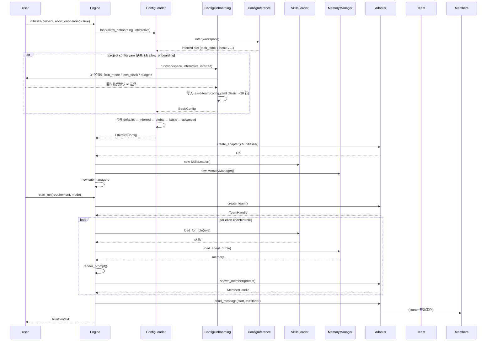
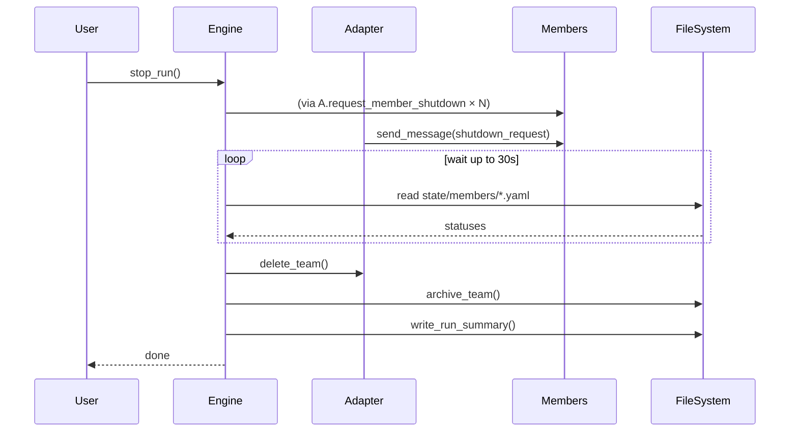

# ai-rd-team 详细设计 - 01 引擎层

> 文档版本：v1.0
> 日期：2026-05-03
> 颗粒度：**实现级**（核心模块）
> 依赖：`00-overview.md`、`10-config-schema.md`、`05-roles-skills.md`、`02-adapter.md`

---

## 1. 目的与范围

### 1.1 目的
定义引擎层的**团队环境管理器**。引擎是 ai-rd-team 的"大脑"，负责：
- 组装所有其他模块（Config / Skills / Memory / Adapter）
- 管理团队和成员的生命周期
- 维护运行时状态（文件层）
- 驱动成本追踪、Hook 触发、文件监听
- **但不做工作流编排**（自主驱动由成员自己完成）

### 1.2 范围
- 引擎核心类 `TeamEnvironmentManager`
- 子管理器（TeamManager / MemberManager / RuntimeStateManager / CostTracker / HookRunner / FileWatcher）
- 启动与关闭流程
- 断点续跑机制
- 错误处理与告警

### 1.3 非目标
- ❌ 成员之间具体怎么协作（成员自主决定，见 `05-roles-skills.md`）
- ❌ 每个功能模块的完整实现（各自有专属设计文档）
- ❌ Web 面板交互（由 `03-service-api.md` 提供接口）

### 1.4 关键区别于"工作流引擎"

| 传统工作流引擎 | ai-rd-team 引擎 |
|---------------|----------------|
| 调度"下一步做什么" | 只管"环境" |
| 流程状态机 | 无流程状态机（成员自主） |
| 决定谁做什么 | Config 决定谁在场，成员自决谁做什么 |
| 条件分支 | 成员用 send_message 自己协商 |

---

## 2. 核心设计原则

### 2.1 引擎是"环境管理器"，不是"指挥官"

原型 P1 验证：给定合适的角色+Skills，成员们能自主工作。引擎只要保证：
- 团队被正确创建
- 所有启用的成员被正确派发
- 运行时文件目录结构就绪
- 成本被追踪
- 异常能被捕获和上报

### 2.2 状态事实源在文件层

遵循 P1 + P3 的结论：引擎自身不维护内存状态快照（除必要 cache 外）。所有**可观察的状态**（团队状态、成员状态、消息、制品）都存在文件里。这样：
- 引擎崩溃重启能续跑
- Web 面板通过文件监听获取状态（不依赖进程间通信）
- 审计天然完整（文件就是日志）

### 2.3 模块组合（composition over inheritance）

引擎通过组合多个子管理器实现功能，不用大而全的单类：

```
TeamEnvironmentManager
├── ConfigLoader              (10-config-schema)
├── SkillsLoader              (05-roles-skills)
├── MemoryManager             (06-memory-system)
├── PromptRenderer            (05-roles-skills)
├── BaseAdapter               (02-adapter)
├── TeamLifecycleManager      (本文)
├── MemberLifecycleManager    (本文)
├── RuntimeStateManager       (本文)
├── CostTracker               (08-cost-control)
├── HookRunner                (09-hooks-security)
├── FileWatcher               (本文)
└── NotificationDispatcher    (可选)
```

---

## 3. 引擎主类：TeamEnvironmentManager

### 3.1 职责

- 对外提供"启动 / 停止 / 暂停 / 恢复 / 查询"高层接口
- 组合子管理器完成具体工作
- 协调子管理器之间的顺序（初始化 / 启动 / 关闭）
- 异常统一处理

### 3.2 类设计

```python
# ai_rd_team/engine/manager.py

from __future__ import annotations

import logging
from dataclasses import dataclass, field
from datetime import datetime
from enum import Enum
from pathlib import Path
from typing import Any, Literal

from ai_rd_team.adapter.base import BaseAdapter, TeamHandle, MemberHandle
from ai_rd_team.adapter.factory import create_adapter
from ai_rd_team.config.loader import ConfigLoader, EffectiveConfig
from ai_rd_team.skills.loader import SkillsLoader
from ai_rd_team.memory.manager import MemoryManager
from ai_rd_team.prompt.renderer import PromptRenderer
from ai_rd_team.cost.tracker import CostTracker
from ai_rd_team.hooks.runner import HookRunner
from ai_rd_team.engine.team_lifecycle import TeamLifecycleManager
from ai_rd_team.engine.member_lifecycle import MemberLifecycleManager
from ai_rd_team.engine.runtime_state import RuntimeStateManager
from ai_rd_team.engine.file_watcher import FileWatcher


logger = logging.getLogger(__name__)


class EngineState(str, Enum):
    IDLE = "idle"                      # 未启动
    INITIALIZING = "initializing"      # 初始化中
    RUNNING = "running"                # 运行中
    PAUSED = "paused"                  # 暂停
    SHUTTING_DOWN = "shutting_down"
    STOPPED = "stopped"                # 已停止
    ERROR = "error"


@dataclass
class RunContext:
    """一次运行的上下文。"""
    run_id: str                        # 唯一运行 ID（UUID）
    team_handle: TeamHandle | None
    mode: Literal["lite", "standard", "full"]
    started_at: datetime
    config: EffectiveConfig
    members: dict[str, MemberHandle] = field(default_factory=dict)
    
    # 运行时指标
    message_count: int = 0
    broadcast_count: int = 0
    iteration_count: int = 0
    resource_points_consumed: int = 0


class TeamEnvironmentManager:
    """ai-rd-team 引擎主类。
    
    职责：环境管理，不做工作流调度。
    """
    
    def __init__(
        self,
        workspace: Path,
        config_loader: ConfigLoader | None = None,
    ):
        self.workspace = workspace.resolve()
        self.config_loader = config_loader or ConfigLoader(
            workspace_dir=workspace / ".ai-rd-team"
        )
        
        self._state: EngineState = EngineState.IDLE
        self._current_run: RunContext | None = None
        
        # 延迟到 initialize() 才创建
        self._config: EffectiveConfig | None = None
        self._adapter: BaseAdapter | None = None
        self._skills_loader: SkillsLoader | None = None
        self._memory_manager: MemoryManager | None = None
        self._prompt_renderer: PromptRenderer | None = None
        self._cost_tracker: CostTracker | None = None
        self._hook_runner: HookRunner | None = None
        self._team_lifecycle: TeamLifecycleManager | None = None
        self._member_lifecycle: MemberLifecycleManager | None = None
        self._runtime_state: RuntimeStateManager | None = None
        self._file_watcher: FileWatcher | None = None
    
    # ===== 公开接口 =====
    
    def initialize(
        self,
        preset: Literal["lite", "standard", "full"] | None = None,
        allow_onboarding: bool = True,
        interactive: bool = True,
    ) -> None:
        """初始化引擎（加载配置+Skills+Memory+Adapter）。
        
        必须在 start_run 之前调用一次。
        
        Args:
            preset: 强制指定档位（覆盖 config.yaml 中的 run_mode）
            allow_onboarding: 若项目 config.yaml 不存在，是否触发首次启动对话引导
                （见 10-config-schema.md §0.2 / §2A）
            interactive: 引导时是否允许交互式询问用户。False 时用推荐默认值无打扰完成
        
        典型场景：
        - `ai-rd-team run "需求"`：initialize(allow_onboarding=True, interactive=True)
        - `ai-rd-team run --no-onboarding "需求"`：initialize(allow_onboarding=False)
        - 在 CI 中：initialize(allow_onboarding=True, interactive=False)
        """
        self._ensure_state(EngineState.IDLE, EngineState.STOPPED)
        self._state = EngineState.INITIALIZING
        
        try:
            self._do_initialize(
                preset=preset,
                allow_onboarding=allow_onboarding,
                interactive=interactive,
            )
            self._state = EngineState.IDLE  # 初始化完成，待 start_run
        except Exception as e:
            self._state = EngineState.ERROR
            logger.exception("Engine initialize failed")
            raise
    
    def start_run(
        self,
        requirement: str,
        run_mode: Literal["lite", "standard", "full"] | None = None,
    ) -> RunContext:
        """开始一次运行。
        
        Args:
            requirement: 用户输入的需求描述
            run_mode: 档位；None 表示使用 config 中 default_mode
        
        Returns:
            RunContext
        """
        self._ensure_state(EngineState.IDLE)
        if self._config is None:
            raise RuntimeError("Engine not initialized")
        
        run_mode = run_mode or self._config.cost_control.default_mode
        if run_mode == "ask":
            raise ValueError(
                "run_mode='ask' cannot be used programmatically; "
                "the caller must resolve user choice first."
            )
        
        self._state = EngineState.RUNNING
        try:
            ctx = self._do_start_run(requirement=requirement, run_mode=run_mode)
            self._current_run = ctx
            return ctx
        except Exception:
            self._state = EngineState.ERROR
            raise
    
    def pause_run(self, reason: str = "") -> None:
        """暂停当前运行（发暂停指令给所有成员）。"""
        self._ensure_state(EngineState.RUNNING)
        self._state = EngineState.PAUSED
        self._runtime_state.write_pause_command(reason=reason)
        self._hook_runner.trigger("run_paused", reason=reason)
    
    def resume_run(self) -> None:
        """恢复当前运行。"""
        self._ensure_state(EngineState.PAUSED)
        self._state = EngineState.RUNNING
        self._runtime_state.write_resume_command()
        self._hook_runner.trigger("run_resumed")
    
    def stop_run(self, reason: str = "completed") -> None:
        """停止当前运行（优雅关闭所有成员，删除团队）。"""
        if self._state not in (EngineState.RUNNING, EngineState.PAUSED):
            return  # 幂等
        
        self._state = EngineState.SHUTTING_DOWN
        try:
            self._do_stop_run(reason=reason)
            self._state = EngineState.STOPPED
        except Exception:
            self._state = EngineState.ERROR
            raise
    
    def get_state(self) -> EngineState:
        return self._state
    
    def get_current_run(self) -> RunContext | None:
        return self._current_run
    
    def escalate_upgrade_mode(
        self,
        target_mode: Literal["standard", "full"],
    ) -> None:
        """运行中升档（只允许 lite→standard→full）。"""
        self._ensure_state(EngineState.RUNNING)
        if self._current_run is None:
            raise RuntimeError("No active run")
        
        current = self._current_run.mode
        allowed = {
            "lite": ["standard", "full"],
            "standard": ["full"],
            "full": [],
        }
        if target_mode not in allowed.get(current, []):
            raise ValueError(
                f"Cannot escalate from {current} to {target_mode}"
            )
        
        self._do_escalate(target_mode)
    
    # ===== 私有：初始化 =====
    
    def _do_initialize(
        self,
        preset,
        allow_onboarding: bool = True,
        interactive: bool = True,
    ) -> None:
        """组合所有子管理器。"""
        logger.info("Loading config...")
        # ConfigLoader 内部：
        #   - defaults → inferred（智能推断）→ global → project basic → project advanced
        #   - 若 basic 缺失且 allow_onboarding=True，触发首次启动对话引导（≤3 问）
        #   - interactive=False 时引导全自动（推荐默认）
        self._config = self.config_loader.load(
            preset=preset,
            allow_onboarding=allow_onboarding,
            interactive=interactive,
        )
        
        logger.info("Initializing adapter...")
        self._adapter = create_adapter(
            platform=self._config.adapter["type"],
            config=self._config.adapter,
        )
        # create_adapter 内部已 adapter.initialize()
        
        logger.info("Verifying adapter capabilities...")
        required_caps = {
            "supports_team_lifecycle": True,
            "supports_async_member_spawn": True,
            "supports_p2p_messaging": True,
        }
        missing = self._adapter.validate_capabilities_for(required_caps)
        if missing:
            raise RuntimeError(
                f"Adapter '{self._adapter.platform_name}' "
                f"lacks required capabilities: {missing}"
            )
        
        logger.info("Loading Skills...")
        self._skills_loader = SkillsLoader(
            builtin_dir=Path(__file__).parent.parent / "skills" / "builtin",
            global_dir=Path.home() / ".ai-rd-team" / "skills",
            workspace_dir=self.workspace / ".ai-rd-team" / "skills",
        )
        
        logger.info("Loading Memory...")
        self._memory_manager = MemoryManager(
            workspace_memory_dir=self.workspace / ".ai-rd-team" / "memory",
        )
        
        logger.info("Preparing PromptRenderer...")
        self._prompt_renderer = PromptRenderer(
            template_dir=Path(__file__).parent.parent / "templates",
        )
        
        logger.info("Initializing CostTracker...")
        self._cost_tracker = CostTracker(
            config=self._config.cost_control,
            workspace=self.workspace,
        )
        
        logger.info("Initializing HookRunner...")
        self._hook_runner = HookRunner(
            hooks_config=self._config.hooks,
            workspace=self.workspace,
        )
        
        logger.info("Initializing lifecycle managers...")
        self._runtime_state = RuntimeStateManager(
            runtime_dir=self.workspace / ".ai-rd-team" / "runtime",
        )
        self._team_lifecycle = TeamLifecycleManager(
            adapter=self._adapter,
            runtime_state=self._runtime_state,
            hook_runner=self._hook_runner,
        )
        self._member_lifecycle = MemberLifecycleManager(
            adapter=self._adapter,
            skills_loader=self._skills_loader,
            memory_manager=self._memory_manager,
            prompt_renderer=self._prompt_renderer,
            runtime_state=self._runtime_state,
            cost_tracker=self._cost_tracker,
            hook_runner=self._hook_runner,
            config=self._config,
        )
        
        logger.info("Starting FileWatcher...")
        self._file_watcher = FileWatcher(
            runtime_dir=self.workspace / ".ai-rd-team" / "runtime",
        )
        # FileWatcher 会在 start_run 时正式 start
    
    # ===== 私有：启动运行 =====
    
    def _do_start_run(
        self,
        requirement: str,
        run_mode: Literal["lite", "standard", "full"],
    ) -> RunContext:
        import uuid
        
        run_id = str(uuid.uuid4())[:8]
        ctx = RunContext(
            run_id=run_id,
            team_handle=None,
            mode=run_mode,
            started_at=datetime.now(),
            config=self._config,
        )
        
        # 1. 写需求和 run 元数据到 runtime/
        self._runtime_state.write_run_metadata(
            run_id=run_id,
            requirement=requirement,
            mode=run_mode,
        )
        
        # 2. 前置 Hook
        self._hook_runner.trigger(
            "run_starting",
            run_id=run_id,
            requirement=requirement,
            mode=run_mode,
        )
        
        # 3. 启动 FileWatcher
        self._file_watcher.start()
        
        # 4. 创建团队
        team = self._team_lifecycle.create(
            team_id=f"ai-rd-team-{run_id}",
            description=f"Run {run_id}: {requirement[:50]}",
        )
        ctx.team_handle = team
        
        # 5. 派发所有启用的成员
        for role_name, role in self._iter_enabled_roles(run_mode):
            instances = self._determine_instances(role)
            for idx in instances:
                member = self._member_lifecycle.spawn(
                    team=team,
                    role=role,
                    instance_index=idx,
                    run_mode=run_mode,
                )
                ctx.members[member.member_id] = member
                self._cost_tracker.record_spawn()
        
        # 6. 发送启动消息（给 pm 或 architect）
        starter = self._find_starter(ctx.members)
        if starter:
            from ai_rd_team.adapter.base import Message, MessageType
            start_msg = self._build_start_message(requirement, ctx)
            self._adapter.send_message(Message(
                from_member="main",
                to_member=starter.member_id,
                msg_type=MessageType.MESSAGE,
                content=start_msg,
                summary="启动任务",
            ))
            self._cost_tracker.record_message(from_="main", to=starter.member_id)
        
        # 7. 触发 run_started Hook
        self._hook_runner.trigger(
            "run_started",
            run_id=run_id,
            team_id=team.team_id,
            member_count=len(ctx.members),
        )
        
        logger.info(
            "Run %s started: mode=%s, members=%d",
            run_id, run_mode, len(ctx.members),
        )
        return ctx
    
    def _iter_enabled_roles(self, run_mode):
        """按档位筛选启用的角色。"""
        preset = self._config_loader_preset(run_mode)
        for name, role in self._config.roles.items():
            if role.enabled and self._role_enabled_in_preset(role, preset):
                yield name, role
    
    def _determine_instances(self, role):
        """决定某角色的实例数。"""
        if not role.scalable:
            return [0]
        # 第一期：静态读 default_instances
        # 第二期：根据 architect 的 task-breakdown 动态决定
        return list(range(role.default_instances))
    
    def _find_starter(self, members: dict[str, MemberHandle]) -> MemberHandle | None:
        """找到应该接收"启动"消息的成员。
        
        优先顺序：pm → analyst → architect → developer_0
        """
        for role in ("pm", "analyst", "architect"):
            for m in members.values():
                if m.role == role:
                    return m
        # 降级：找第一个 developer
        for m in members.values():
            if m.role == "developer":
                return m
        return None
    
    def _build_start_message(self, requirement: str, ctx: RunContext) -> str:
        return f"""请开始项目工作。

需求描述：
{requirement}

运行档位：{ctx.mode}
团队成员：
{self._format_team_roster(ctx.members)}

请按你的角色 Persona 和 Skills 自主推进。遇到问题直接与队友沟通（send_message）。
重要决策请写到 .ai-rd-team/memory/decisions/ 下的 ADR 文件。
完成或遇到阻塞时通知 main。

开始工作！"""
    
    def _format_team_roster(self, members: dict[str, MemberHandle]) -> str:
        return "\n".join(
            f"- {m.display_name}（{m.role}, instance_id={m.member_id}）"
            for m in members.values()
        )
    
    # ===== 私有：停止运行 =====
    
    def _do_stop_run(self, reason: str) -> None:
        ctx = self._current_run
        if ctx is None:
            return
        
        logger.info("Stopping run %s: %s", ctx.run_id, reason)
        
        # 1. 前置 Hook
        self._hook_runner.trigger(
            "run_stopping",
            run_id=ctx.run_id,
            reason=reason,
        )
        
        # 2. 优雅关闭所有成员
        for member in list(ctx.members.values()):
            try:
                self._member_lifecycle.shutdown(member, reason=reason)
            except Exception as e:
                logger.warning("Failed to shutdown member %s: %s", member.member_id, e)
        
        # 3. 等待成员响应或超时
        import time
        deadline = time.time() + 30
        while time.time() < deadline:
            all_done = all(
                self._runtime_state.get_member_status(m.member_id) in ("done", "failed", "terminated")
                for m in ctx.members.values()
            )
            if all_done:
                break
            time.sleep(1)
        
        # 4. 删除团队
        if ctx.team_handle:
            try:
                self._team_lifecycle.delete(ctx.team_handle)
            except Exception as e:
                logger.error("Failed to delete team: %s", e)
        
        # 5. 生成总结报告
        self._generate_run_summary(ctx, reason=reason)
        
        # 6. 关闭 FileWatcher
        self._file_watcher.stop()
        
        # 7. Post-run Hook + 成本记录引导
        self._hook_runner.trigger("run_stopped", run_id=ctx.run_id, reason=reason)
        if self._config.cost_control.post_run_recording_enabled:
            self._cost_tracker.prompt_user_to_record_actual()
        
        self._current_run = None
    
    def _generate_run_summary(self, ctx: RunContext, reason: str) -> None:
        """生成本次运行总结报告到 runtime/reports/summary.md。"""
        summary = {
            "run_id": ctx.run_id,
            "started_at": ctx.started_at.isoformat(),
            "ended_at": datetime.now().isoformat(),
            "mode": ctx.mode,
            "reason": reason,
            "members": [
                {
                    "member_id": m.member_id,
                    "role": m.role,
                    "display_name": m.display_name,
                }
                for m in ctx.members.values()
            ],
            "metrics": self._cost_tracker.snapshot(),
            "artifacts_count": self._runtime_state.count_artifacts(),
        }
        self._runtime_state.write_run_summary(ctx.run_id, summary)
    
    # ===== 私有：升档 =====
    
    def _do_escalate(self, target_mode):
        ctx = self._current_run
        old_mode = ctx.mode
        
        # 1. 计算需要新增的成员
        old_enabled = set(self._iter_enabled_role_names(old_mode))
        new_enabled = set(self._iter_enabled_role_names(target_mode))
        to_add = new_enabled - old_enabled
        
        logger.info("Escalating %s → %s: adding %s", old_mode, target_mode, to_add)
        
        # 2. 派发新成员
        for role_name in to_add:
            role = self._config.roles[role_name]
            instances = self._determine_instances(role)
            for idx in instances:
                member = self._member_lifecycle.spawn(
                    team=ctx.team_handle,
                    role=role,
                    instance_index=idx,
                    run_mode=target_mode,
                )
                ctx.members[member.member_id] = member
                self._cost_tracker.record_spawn()
        
        # 3. 通知已有成员（可选）
        # 4. 更新 ctx.mode
        ctx.mode = target_mode
        self._hook_runner.trigger("run_upgraded", old_mode=old_mode, new_mode=target_mode)
    
    # ===== 私有：状态检查 =====
    
    def _ensure_state(self, *allowed: EngineState) -> None:
        if self._state not in allowed:
            raise RuntimeError(
                f"Engine in state {self._state}, "
                f"expected one of {[s.value for s in allowed]}"
            )
```

---

## 4. TeamLifecycleManager

### 4.1 职责
封装团队创建和销毁的完整流程（含前置 hook、runtime 文件初始化、错误处理）。

### 4.2 实现

```python
# ai_rd_team/engine/team_lifecycle.py

class TeamLifecycleManager:
    def __init__(
        self,
        adapter: BaseAdapter,
        runtime_state: "RuntimeStateManager",
        hook_runner: "HookRunner",
    ):
        self.adapter = adapter
        self.runtime_state = runtime_state
        self.hook_runner = hook_runner
    
    def create(self, team_id: str, description: str = "") -> TeamHandle:
        self.hook_runner.trigger("team_creating", team_id=team_id)
        
        team = self.adapter.create_team(team_id, description)
        
        # 初始化 runtime 目录结构
        self.runtime_state.initialize_team(team)
        
        self.hook_runner.trigger("team_created", team_id=team_id)
        return team
    
    def delete(self, team: TeamHandle) -> None:
        self.hook_runner.trigger("team_deleting", team_id=team.team_id)
        
        # 归档 runtime 目录（而不是直接清理）
        self.runtime_state.archive_team(team)
        
        self.adapter.delete_team(team)
        
        self.hook_runner.trigger("team_deleted", team_id=team.team_id)
```

---

## 5. MemberLifecycleManager

### 5.1 职责
组装 Skills + Memory + Persona → Prompt → 调 Adapter 派发 → 写初始 state。

### 5.2 实现

```python
# ai_rd_team/engine/member_lifecycle.py

class MemberLifecycleManager:
    def __init__(
        self,
        adapter,
        skills_loader,
        memory_manager,
        prompt_renderer,
        runtime_state,
        cost_tracker,
        hook_runner,
        config,
    ):
        self.adapter = adapter
        self.skills_loader = skills_loader
        self.memory_manager = memory_manager
        self.prompt_renderer = prompt_renderer
        self.runtime_state = runtime_state
        self.cost_tracker = cost_tracker
        self.hook_runner = hook_runner
        self.config = config
    
    def spawn(
        self,
        team: TeamHandle,
        role: "Role",
        instance_index: int,
        run_mode: str,
    ) -> MemberHandle:
        # 1. 实例名
        instance_name = self._make_instance_name(role.name, instance_index)
        display_name = self._make_display_name(role, instance_index)
        
        # 2. 加载 Skills
        skills = self.skills_loader.load_for_role(role)
        
        # 3. 加载 agent.d 记忆
        agent_d = self.memory_manager.load_agent_d(role, scope=role.memory_scope.get("agent_d", []))
        
        # 4. 组装团队名册（runtime_state 维护）
        roster = self.runtime_state.get_team_roster(team.team_id)
        
        # 5. 渲染 Prompt
        prompt = self.prompt_renderer.render(
            role=role,
            instance_name=instance_name,
            display_name=display_name,
            config=self.config,
            skills=skills,
            agent_d_memory=agent_d,
            team_roster=roster,
            run_mode=run_mode,
        )
        
        # 6. 派发
        self.hook_runner.trigger(
            "member_spawning",
            role=role.name,
            instance_name=instance_name,
        )
        
        member = self.adapter.spawn_member(
            team=team,
            member_id=instance_name,
            role=role.name,
            display_name=display_name,
            rendered_prompt=prompt,
            options={
                "subagent_name": "code-explorer",
                "mode": "bypassPermissions",
                "max_turns": 50,
            },
        )
        
        # 7. 写初始 state
        self.runtime_state.write_member_initial_state(
            team_id=team.team_id,
            member=member,
        )
        
        # 8. 记录 roster
        self.runtime_state.add_to_roster(team.team_id, member)
        
        # 9. Hook
        self.hook_runner.trigger(
            "member_spawned",
            role=role.name,
            instance_name=instance_name,
            prompt_tokens=self.prompt_renderer.estimate_prompt_tokens(prompt),
        )
        
        return member
    
    def shutdown(
        self,
        member: MemberHandle,
        reason: str = "",
    ) -> None:
        self.hook_runner.trigger(
            "member_shutdown_requesting",
            member_id=member.member_id,
        )
        self.adapter.request_member_shutdown(member, reason=reason)
    
    @staticmethod
    def _make_instance_name(role_name: str, idx: int) -> str:
        if idx == 0:
            return role_name            # 如 "architect"
        return f"{role_name}_{idx + 1}"  # "developer_2"
    
    def _make_display_name(self, role: "Role", idx: int) -> str:
        if role.scalable:
            template = role.display_name_template or (role.display_name + "{index}")
            return template.format(index=idx + 1)
        return role.display_name
```

---

## 6. RuntimeStateManager

### 6.1 职责
维护 `.ai-rd-team/runtime/` 下所有状态文件的读写。

### 6.2 runtime 目录结构

```
.ai-rd-team/runtime/
├── current-run.yaml              # 当前运行元数据（run_id, mode, 启动时间等）
├── state/
│   ├── team.yaml                 # 团队状态（原子写）
│   ├── members/
│   │   ├── architect.yaml        # 每成员 state（成员写，引擎/Web 读）
│   │   └── developer_1.yaml
│   └── roster.yaml               # 名册（引擎写，成员读）
├── messages/
│   └── YYYYMMDD-HHMMSS-from-to.json
├── events.jsonl                  # 事件流（fcntl 锁追加）
├── artifacts/
│   ├── design/
│   ├── code/
│   ├── test/
│   ├── review/
│   ├── requirements/
│   ├── deployment/
│   └── reports/
├── commands/                     # 用户对 Team 的操作指令
│   ├── pending/                  # 待处理
│   └── processed/                # 已处理（归档）
├── cost/
│   ├── resource-points.yaml      # 实时累计
│   ├── model-history.jsonl       # 模型切换历史
│   └── post-run.jsonl            # 事后记录
├── logs/
│   ├── engine.log
│   └── adapter-calls.jsonl
├── adapter-intents/              # Bridge 意图文件
├── adapter-results/              # Bridge 结果文件
└── archive/
    └── run-{run_id}/             # 已完成运行的归档（run_id 由 current-run.yaml 定义）
```

> **权威文档**：runtime/ 目录下所有文件的**具体 Schema** 见 `11-runtime-protocol.md`。本节仅展示总体结构。

### 6.3 实现

```python
# ai_rd_team/engine/runtime_state.py

import json
import time
from datetime import datetime
from pathlib import Path

import yaml

from ai_rd_team.shared.file_ops import atomic_write, locked_append


class RuntimeStateManager:
    def __init__(self, runtime_dir: Path):
        self.runtime_dir = runtime_dir
        self._ensure_structure()
    
    def _ensure_structure(self) -> None:
        """确保目录结构存在。"""
        for sub in [
            "state/members",
            "messages",
            "artifacts/design",
            "artifacts/code",
            "artifacts/test",
            "artifacts/review",
            "artifacts/requirements",
            "artifacts/deployment",
            "artifacts/reports",
            "commands/pending",
            "cost",
            "logs",
            "adapter-intents",
            "adapter-results",
            "archive",
        ]:
            (self.runtime_dir / sub).mkdir(parents=True, exist_ok=True)
    
    def write_run_metadata(
        self,
        run_id: str,
        requirement: str,
        mode: str,
    ) -> None:
        data = {
            "run_id": run_id,
            "requirement": requirement,
            "mode": mode,
            "started_at": datetime.now().isoformat(),
            "status": "running",
        }
        atomic_write(
            self.runtime_dir / "current-run.yaml",
            yaml.safe_dump(data, allow_unicode=True, sort_keys=False),
        )
    
    def write_pause_command(self, reason: str) -> None:
        path = self.runtime_dir / "commands" / "pending" / f"pause-{int(time.time())}.json"
        atomic_write(
            path,
            json.dumps({
                "command": "pause",
                "reason": reason,
                "ts": datetime.now().isoformat(),
            }, ensure_ascii=False),
        )
    
    def write_resume_command(self) -> None:
        path = self.runtime_dir / "commands" / "pending" / f"resume-{int(time.time())}.json"
        atomic_write(
            path,
            json.dumps({
                "command": "resume",
                "ts": datetime.now().isoformat(),
            }, ensure_ascii=False),
        )
    
    def initialize_team(self, team) -> None:
        """团队创建后初始化 state/team.yaml。"""
        data = {
            "team_id": team.team_id,
            "platform_id": team.platform_id,
            "created_at": team.created_at.isoformat(),
            "status": "running",
        }
        atomic_write(
            self.runtime_dir / "state" / "team.yaml",
            yaml.safe_dump(data, allow_unicode=True),
        )
    
    def archive_team(self, team) -> None:
        """归档 team 到 archive/run-{run_id}/。"""
        # 读取 current-run.yaml 拿到 run_id
        run_meta = yaml.safe_load((self.runtime_dir / "current-run.yaml").read_text())
        run_id = run_meta.get("run_id", "unknown")
        
        import shutil
        target = self.runtime_dir / "archive" / f"run-{run_id}"
        target.mkdir(parents=True, exist_ok=True)
        
        # 移动关键目录
        for sub in ("state", "messages", "artifacts", "logs", "cost"):
            src = self.runtime_dir / sub
            if src.exists():
                shutil.copytree(src, target / sub, dirs_exist_ok=True)
        
        # 清空 state/members（成员已归档）
        # 其他目录可选清理
    
    def write_member_initial_state(self, team_id: str, member) -> None:
        state_path = self.runtime_dir / "state" / "members" / f"{member.member_id}.yaml"
        data = {
            "name": member.member_id,
            "role": member.role,
            "display_name": member.display_name,
            "team_id": team_id,
            "status": "idle",
            "current_task": None,
            "created_at": member.created_at.isoformat(),
            "last_updated": datetime.now().isoformat(),
            "progress": "0%",
            "produced_files": [],
            "blocking_issues": [],
            "communication_log": [],
        }
        atomic_write(state_path, yaml.safe_dump(data, allow_unicode=True, sort_keys=False))
    
    def get_member_status(self, member_id: str) -> str:
        """读取成员 state，返回 status 字段。失败返回 'unknown'。"""
        path = self.runtime_dir / "state" / "members" / f"{member_id}.yaml"
        if not path.exists():
            return "unknown"
        try:
            data = yaml.safe_load(path.read_text())
            return data.get("status", "unknown")
        except Exception:
            return "unknown"
    
    def add_to_roster(self, team_id: str, member) -> None:
        """追加到名册。"""
        roster_path = self.runtime_dir / "state" / "roster.yaml"
        if roster_path.exists():
            roster = yaml.safe_load(roster_path.read_text()) or {"members": []}
        else:
            roster = {"team_id": team_id, "members": []}
        roster["members"].append({
            "member_id": member.member_id,
            "role": member.role,
            "display_name": member.display_name,
        })
        atomic_write(roster_path, yaml.safe_dump(roster, allow_unicode=True))
    
    def get_team_roster(self, team_id: str) -> list[dict]:
        roster_path = self.runtime_dir / "state" / "roster.yaml"
        if not roster_path.exists():
            return []
        data = yaml.safe_load(roster_path.read_text()) or {}
        return data.get("members", [])
    
    def count_artifacts(self) -> int:
        artifacts_dir = self.runtime_dir / "artifacts"
        return sum(1 for _ in artifacts_dir.rglob("*") if _.is_file())
    
    def write_run_summary(self, run_id: str, summary: dict) -> None:
        path = self.runtime_dir / "archive" / f"run-{run_id}" / "summary.yaml"
        path.parent.mkdir(parents=True, exist_ok=True)
        atomic_write(path, yaml.safe_dump(summary, allow_unicode=True, sort_keys=False))
    
    def emit_event(self, event_name: str, **data) -> None:
        """追加事件到 events.jsonl。"""
        record = {
            "ts": datetime.now().isoformat(),
            "event": event_name,
            **data,
        }
        locked_append(
            self.runtime_dir / "events.jsonl",
            json.dumps(record, ensure_ascii=False) + "\n",
        )
```

---

## 7. FileWatcher

### 7.1 职责
监听 `runtime/` 目录的变化，触发相应处理：
- state/members/*.yaml 变化 → 更新内存快照（Web 查询用）
- commands/pending/* 新文件 → 引擎读取处理
- artifacts/* 新文件 → 触发 Hook

### 7.2 实现

```python
# ai_rd_team/engine/file_watcher.py

import logging
from pathlib import Path
from queue import Queue, Empty
from threading import Thread

try:
    from watchdog.events import FileSystemEventHandler
    from watchdog.observers import Observer
    HAS_WATCHDOG = True
except ImportError:
    HAS_WATCHDOG = False


logger = logging.getLogger(__name__)


class FileWatcher:
    """监听 runtime/ 目录变化。"""
    
    def __init__(self, runtime_dir: Path):
        self.runtime_dir = runtime_dir
        self._event_queue: Queue = Queue()
        self._observer = None
        self._poll_thread: Thread | None = None
        self._stopped = False
    
    def start(self) -> None:
        if HAS_WATCHDOG:
            self._start_watchdog()
        else:
            logger.warning("watchdog not installed; falling back to polling")
            self._start_polling()
    
    def stop(self) -> None:
        self._stopped = True
        if self._observer:
            self._observer.stop()
            self._observer.join(timeout=5)
        if self._poll_thread:
            self._poll_thread.join(timeout=5)
    
    def subscribe(self, callback):
        """注册回调。callback 签名：(event_type, path) -> None"""
        # 第一期简化：直接从 queue 拉取
        ...
    
    def _start_watchdog(self):
        class Handler(FileSystemEventHandler):
            def __init__(self, queue):
                self.queue = queue
            
            def on_any_event(self, event):
                if event.is_directory:
                    return
                self.queue.put((event.event_type, Path(event.src_path)))
        
        self._observer = Observer()
        self._observer.schedule(
            Handler(self._event_queue),
            str(self.runtime_dir),
            recursive=True,
        )
        self._observer.start()
    
    def _start_polling(self):
        # 简化：每 1s 扫描一次 mtime
        ...
    
    def poll_events(self, timeout: float = 0.1):
        """获取一个事件（非阻塞）。"""
        try:
            return self._event_queue.get(timeout=timeout)
        except Empty:
            return None
```

---

## 8. 断点续跑

### 8.1 机制

如果引擎崩溃（或用户主动停机），下次启动时能从上次状态恢复：

```python
class TeamEnvironmentManager:
    def resume_from_last_run(self) -> RunContext | None:
        """尝试从 runtime/ 恢复上次运行。
        
        若 runtime/current-run.yaml 存在且 status == "running"，恢复。
        """
        current_run_path = self.workspace / ".ai-rd-team" / "runtime" / "current-run.yaml"
        if not current_run_path.exists():
            return None
        
        import yaml
        data = yaml.safe_load(current_run_path.read_text())
        if data.get("status") != "running":
            return None
        
        # 恢复 RunContext
        run_id = data["run_id"]
        mode = data["mode"]
        
        # 尝试重新连接 Adapter（CodeBuddy 的 team 可能还在）
        # 读取 roster.yaml 恢复成员
        # ...
        
        logger.info("Resumed run %s", run_id)
        ...
```

### 8.2 可恢复性限制

| 场景 | 可恢复？ |
|------|---------|
| 引擎崩溃 + Team 还在 | ✅ 恢复 |
| 引擎崩溃 + Team 被 CodeBuddy 清理 | ❌ 需重启 |
| 引擎正常停机 | ✅ 通过 pause/resume |
| 用户主动 stop_run | ❌ 不恢复（已归档） |

### 8.3 recovery 决策

```python
def auto_recovery_on_init(self) -> Literal["resume", "ignore", "prompt"]:
    """决定启动时如何处理上次残留。
    
    - resume: 自动恢复
    - ignore: 忽略（跳过残留，开新的）
    - prompt: 问用户
    """
    # 第一期：prompt（用户确认）
    return "prompt"
```

---

## 9. 错误处理与告警

### 9.1 错误分级

| 级别 | 说明 | 行为 |
|-----|------|------|
| FATAL | 引擎无法继续 | 记录 → 停止 → 告警 |
| ERROR | 单个操作失败 | 记录 → 重试（可选） → 降级 |
| WARN | 可恢复的异常 | 记录 → 继续 |
| INFO | 重要事件 | 记录 |

### 9.2 成员失败的处理

当某成员 `status=failed`：

```python
def _handle_member_failure(self, member_id: str) -> None:
    state = self.runtime_state.get_member_status(member_id)
    if state != "failed":
        return
    
    member = self._current_run.members[member_id]
    role = self._config.roles[member.role]
    
    # 策略 1：如果可伸缩角色，尝试派发新实例替补
    if role.scalable:
        logger.warning("Member %s failed; spawning replacement", member_id)
        new_member = self._member_lifecycle.spawn(
            team=self._current_run.team_handle,
            role=role,
            instance_index=self._next_available_index(role),
            run_mode=self._current_run.mode,
        )
        self._current_run.members[new_member.member_id] = new_member
    # 策略 2：关键角色失败，通知 pm + main
    elif role.name in ("architect", "pm"):
        self._escalate_to_user(f"Critical role {role.name} failed")
    # 策略 3：其他角色失败，继续运行但标记
    else:
        self._hook_runner.trigger("member_failed", member_id=member_id)
```

### 9.3 全局异常捕获

```python
class TeamEnvironmentManager:
    def _with_error_boundary(self, operation: str, fn):
        try:
            return fn()
        except Exception as e:
            logger.exception("Engine operation failed: %s", operation)
            self._hook_runner.trigger(
                "engine_error",
                operation=operation,
                error=str(e),
            )
            raise
```

---

## 10. 与其他模块的集成时序

### 10.1 启动时序



### 10.2 停止时序



---

## 11. 性能预期

| 阶段 | 预期耗时 |
|------|---------|
| `initialize` | < 5s |
| `start_run`（Lite, 1 成员） | < 15s |
| `start_run`（Standard, 5 成员） | < 45s |
| `start_run`（Full, 15 成员） | < 2min |
| `stop_run`（优雅） | < 30s |
| `resume_from_last_run` | < 10s |

---

## 12. 关键设计决策

| # | 决策 | 理由 |
|---|-----|------|
| ED1 | 引擎是"环境管理器"不做工作流调度 | P1 验证成员自主驱动可行 |
| ED2 | 状态事实源在文件层，引擎不持有状态 | 支持断点续跑 + Web 零耦合 |
| ED3 | 组合多个子管理器而非单一大类 | 可测试、可替换、职责清晰 |
| ED4 | runtime/ 目录归档而非清理 | 保留审计轨迹 |
| ED5 | 成员失败的 3 种应对策略 | 可伸缩替补 / 关键角色告警 / 普通继续 |
| ED6 | 升档只加成员不改已有成员上下文 | 避免中断正在进行的工作 |
| ED7 | 启动时只发一条消息给 "starter" | P1 验证 main 零干预效果好 |
| ED8 | 断点续跑第一期采用 prompt 询问 | 避免自动恢复导致副作用 |
| ED9 | Engine.initialize 支持零配置 + 对话引导 | AI 时代低门槛（10-config §0）：`allow_onboarding=True` 时缺配置自动走 3 问引导；`interactive=False` 支持 CI |

---

## 13. 验收标准

- ✅ TeamEnvironmentManager 实现完整生命周期（init → start → pause/resume → stop）
- ✅ 子管理器（Team/Member Lifecycle、RuntimeState、FileWatcher）职责清晰
- ✅ `runtime/` 目录结构按约定创建和归档
- ✅ 升档只增量加成员，已有成员不重启
- ✅ 成员失败的 3 种策略都有测试覆盖
- ✅ 断点续跑能从 `runtime/current-run.yaml` 恢复
- ✅ FileWatcher 支持 watchdog + 轮询降级
- ✅ 启动性能达到 §11 的预期
- ✅ 核心模块单元测试覆盖率 ≥ 80%

---

## 14. 对其他文档的接口

| 使用方 | 接口 |
|-------|-----|
| `00-overview.md` | 本文档是该总览中"引擎层"的详细定义 |
| `02-adapter.md` | Engine 通过 create_adapter() 使用 Adapter |
| `05-roles-skills.md` | Engine 组合 SkillsLoader + PromptRenderer |
| `03-service-api.md` | REST API 调用 Engine 的 start_run/stop_run/pause_run |
| `04-web-panel.md` | Web 通过 FileWatcher 监听 runtime/ 变化 |
| `06-memory-system.md` | Engine 组合 MemoryManager |
| `08-cost-control.md` | Engine 组合 CostTracker |
| `09-hooks-security.md` | Engine 组合 HookRunner |
| `11-runtime-protocol.md` | runtime/ 目录结构在本文档定义，该文档细化协议 |

---

## 15. 附录：典型运行示例

### 15.1 API 使用示例

```python
from pathlib import Path
from ai_rd_team.engine.manager import TeamEnvironmentManager

# 初始化
engine = TeamEnvironmentManager(workspace=Path.cwd())
engine.initialize(preset="standard")

# 启动运行
ctx = engine.start_run(
    requirement="实现一个用户管理模块，包含注册/登录/资料修改",
    run_mode="standard",
)

# 查询状态（同步）
state = engine.get_state()
current = engine.get_current_run()

# 运行中可升档
engine.escalate_upgrade_mode("full")

# 用户决定停止
engine.stop_run(reason="user_requested")

# 或暂停/恢复
engine.pause_run(reason="user_requested")
engine.resume_run()
```

### 15.2 CLI 使用示例（未来）

```bash
$ ai-rd-team init                    # 首次引导
$ ai-rd-team run "实现用户管理模块" --mode=standard
$ ai-rd-team status                  # 查询当前状态
$ ai-rd-team pause                   # 暂停
$ ai-rd-team resume                  # 恢复
$ ai-rd-team stop                    # 停止
$ ai-rd-team escalate --to=full      # 升档
$ ai-rd-team serve                   # 启动 Web 面板
```
