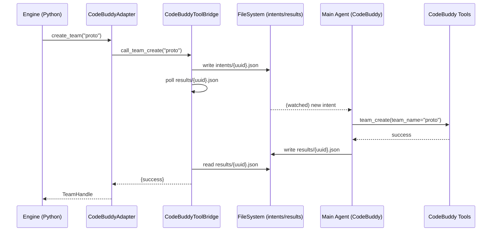

# ai-rd-team 详细设计 - 02 适配层

> 文档版本：v1.0
> 日期：2026-05-03
> 颗粒度：**实现级**（核心模块）
> 依赖：`00-overview.md`、`10-config-schema.md`、`05-roles-skills.md`

---

## 1. 目的与范围

### 1.1 目的
定义 BaseAdapter 抽象接口和 CodeBuddyAdapter 具体实现。适配层是 ai-rd-team 未来扩展到其他平台（Trae/Qoder）的唯一接口点——**引擎层只通过 BaseAdapter 调用，不直接调用 CodeBuddy 工具**。

### 1.2 范围
- BaseAdapter 抽象类定义（接口 + 契约）
- Adapter 能力查询机制（capabilities）
- CodeBuddyAdapter 完整实现
- AdapterFactory 与注册机制
- 错误处理 + 重试
- 为未来 Trae/Qoder Adapter 预留扩展点

### 1.3 非目标
- ❌ 实现 Trae/Qoder Adapter（第二期）
- ❌ 直接使用的具体业务逻辑（引擎层职责）
- ❌ 模型选择和降级执行（cost_control 模块职责）

---

## 2. 核心设计原则

### 2.1 平台无关

BaseAdapter 接口定义要**彻底平台无关**：
- 方法名、参数、返回值不带 CodeBuddy 特有概念
- 不暴露 `team_create`、`task`、`send_message` 等工具名
- 用 ai-rd-team 自己的语义表达

例：
- ❌ 错：`def create_team(name): ...`（CodeBuddy 专有）
- ✅ 对：`def create_team_environment(name) -> TeamHandle: ...`

### 2.2 能力声明与降级

不是所有平台都有 P2P 消息，所以每个 Adapter 必须**声明能力**。引擎层根据能力决定行为模式。

```python
@dataclass(frozen=True)
class Capabilities:
    # 核心能力
    supports_team_lifecycle: bool            # 团队创建与销毁
    supports_async_member_spawn: bool        # 异步成员派发
    supports_p2p_messaging: bool             # ⭐ 成员间 P2P
    supports_broadcast: bool                 # 广播消息
    supports_shutdown_request: bool          # 优雅关闭
    
    # 高级能力
    supports_role_specific_model: bool       # 角色×模型独立配置
    supports_runtime_model_switch: bool      # 运行时切换模型
    supports_member_state_query: bool        # 查询成员状态
    
    # 限制
    max_concurrent_members: int              # 最大并发成员数
    message_size_limit_bytes: int            # 单条消息上限
    spawn_timeout_seconds: int               # 成员 spawn 超时
```

### 2.3 版本感知

CodeBuddy 工具集会随版本变化（用户已提醒 `todo_write` 在某些版本被替换）。Adapter 启动时探测版本并适配：

```python
class CodeBuddyAdapter(BaseAdapter):
    def __init__(self, config):
        super().__init__(config)
        self.version_info = self._probe_version()
        self.capabilities = self._derive_capabilities(self.version_info)
    
    def _probe_version(self) -> VersionInfo:
        """探测当前 CodeBuddy 版本与可用工具。"""
        ...
```

### 2.4 副作用本地化

所有 Adapter 调用的副作用（派发成员、发消息、删团队）必须：
- **幂等**：重复调用不产生重复副作用
- **可追溯**：每次调用写 adapter-call.jsonl 日志
- **失败可重试**：有显式重试策略

---

## 3. BaseAdapter 抽象接口

### 3.1 数据类定义

```python
# ai_rd_team/adapter/base.py

from __future__ import annotations

import abc
from dataclasses import dataclass, field
from datetime import datetime
from enum import Enum
from pathlib import Path
from typing import Any, Callable, Literal


# ===== 枚举 =====

class MessageType(str, Enum):
    MESSAGE = "message"
    BROADCAST = "broadcast"
    SHUTDOWN_REQUEST = "shutdown_request"
    SHUTDOWN_RESPONSE = "shutdown_response"
    PLAN_APPROVAL_RESPONSE = "plan_approval_response"


class MemberStatus(str, Enum):
    SPAWNING = "spawning"      # 正在派发
    IDLE = "idle"              # 已启动，等待消息
    WORKING = "working"        # 工作中
    WAITING = "waiting"        # 等待响应
    DONE = "done"              # 完成
    FAILED = "failed"          # 失败
    TERMINATED = "terminated"  # 被强制关闭


class TeamStatus(str, Enum):
    CREATING = "creating"
    RUNNING = "running"
    PAUSING = "pausing"
    PAUSED = "paused"
    SHUTTING_DOWN = "shutting_down"
    SHUT_DOWN = "shut_down"
    ERROR = "error"


# ===== 值对象 =====

@dataclass(frozen=True)
class TeamHandle:
    """团队句柄（平台无关）。"""
    team_id: str                  # 业务层 ID（稳定）
    platform_id: str              # 平台内部 ID（如 CodeBuddy team_name）
    created_at: datetime
    platform: str                 # "codebuddy" / "trae" / "qoder"


@dataclass(frozen=True)
class MemberHandle:
    """成员句柄（平台无关）。"""
    member_id: str                # 业务层 ID（通常是 instance_name）
    team_id: str
    platform_id: str | None       # CodeBuddy 返回的内部 ID
    role: str                     # 角色名
    display_name: str
    created_at: datetime


@dataclass(frozen=True)
class Message:
    """成员间消息（平台无关）。"""
    from_member: str              # 发送者 member_id，或 "main"
    to_member: str                # 接收者 member_id，或 "main"、"all"
    msg_type: MessageType
    content: str
    summary: str = ""
    ts: datetime = field(default_factory=datetime.now)


@dataclass(frozen=True)
class Capabilities:
    supports_team_lifecycle: bool
    supports_async_member_spawn: bool
    supports_p2p_messaging: bool
    supports_broadcast: bool
    supports_shutdown_request: bool
    supports_role_specific_model: bool
    supports_runtime_model_switch: bool
    supports_member_state_query: bool
    max_concurrent_members: int
    message_size_limit_bytes: int
    spawn_timeout_seconds: int


@dataclass(frozen=True)
class VersionInfo:
    platform: str                 # "codebuddy"
    version: str | None           # "4.3.3" / None if unknown
    detected_at: datetime
    available_tools: frozenset[str]   # 探测到的可用工具名
    notes: str = ""


# ===== 异常 =====

class AdapterError(Exception):
    """所有 Adapter 层错误的基类。"""


class AdapterInitError(AdapterError):
    """Adapter 初始化失败。"""


class TeamOperationError(AdapterError):
    """团队操作失败。"""


class MemberOperationError(AdapterError):
    """成员操作失败。"""


class MessageDeliveryError(AdapterError):
    """消息投递失败。"""


class CapabilityNotSupportedError(AdapterError):
    """请求的能力当前 Adapter 不支持。"""


class RetryExhaustedError(AdapterError):
    """重试次数耗尽。"""
```

### 3.2 BaseAdapter 抽象类

```python
# ai_rd_team/adapter/base.py 续

class BaseAdapter(abc.ABC):
    """所有平台 Adapter 的基类。
    
    实现者必须覆盖 @abc.abstractmethod 标注的方法。
    """
    
    # --- 初始化 ---
    
    def __init__(self, config: dict[str, Any]):
        """
        Args:
            config: EffectiveConfig.adapter 的内容（不是整个 config）
        """
        self._config = config
        self._version_info: VersionInfo | None = None
        self._capabilities: Capabilities | None = None
    
    @abc.abstractmethod
    def initialize(self) -> None:
        """
        在首次使用前调用。完成：
        - 版本探测
        - 能力推导
        - 连接测试（如适用）
        - 必要资源准备
        
        Raises:
            AdapterInitError
        """
    
    # --- 元信息查询 ---
    
    @property
    def platform_name(self) -> str:
        """平台名，如 'codebuddy'。"""
        return self.__class__.__name__.replace("Adapter", "").lower()
    
    @property
    def version_info(self) -> VersionInfo:
        if self._version_info is None:
            raise AdapterError("Adapter not initialized; call initialize() first")
        return self._version_info
    
    @property
    def capabilities(self) -> Capabilities:
        if self._capabilities is None:
            raise AdapterError("Adapter not initialized; call initialize() first")
        return self._capabilities
    
    # --- 团队生命周期 ---
    
    @abc.abstractmethod
    def create_team(
        self,
        team_id: str,
        description: str = "",
    ) -> TeamHandle:
        """创建一个团队环境。
        
        Args:
            team_id: 业务层 ID（调用方决定，应唯一）
            description: 团队描述
        
        Returns:
            TeamHandle
        
        Raises:
            TeamOperationError
        """
    
    @abc.abstractmethod
    def delete_team(self, team: TeamHandle) -> None:
        """删除团队。调用方应确保所有成员已优雅关闭。
        
        Raises:
            TeamOperationError
        """
    
    @abc.abstractmethod
    def get_team_status(self, team: TeamHandle) -> TeamStatus:
        """查询团队状态。"""
    
    # --- 成员生命周期 ---
    
    @abc.abstractmethod
    def spawn_member(
        self,
        team: TeamHandle,
        member_id: str,
        role: str,
        display_name: str,
        rendered_prompt: str,
        options: dict[str, Any] | None = None,
    ) -> MemberHandle:
        """在团队中派发一个成员。
        
        Args:
            team: 团队句柄
            member_id: 业务层 ID（实例名）
            role: 角色名（用于平台选择 subagent 类型）
            display_name: 中文名（用于日志/展示）
            rendered_prompt: PromptRenderer 产出的完整 prompt
            options: 平台特定选项（如 max_turns/mode）
        
        Returns:
            MemberHandle
        
        Raises:
            MemberOperationError
        """
    
    @abc.abstractmethod
    def request_member_shutdown(
        self,
        member: MemberHandle,
        reason: str = "",
    ) -> None:
        """请求成员优雅关闭。
        
        调用方应等待 shutdown_response 或超时后再 delete_team。
        
        Raises:
            MemberOperationError
        """
    
    @abc.abstractmethod
    def get_member_status(self, member: MemberHandle) -> MemberStatus:
        """查询成员状态。
        
        **注意**：CodeBuddy 可能不支持，退化为从 state 文件读。
        """
    
    # --- 消息通信 ---
    
    @abc.abstractmethod
    def send_message(self, msg: Message) -> None:
        """投递消息。
        
        调用方负责：
        - msg.to_member 存在
        - msg.content 不超过 capabilities.message_size_limit_bytes
        
        Raises:
            MessageDeliveryError
            CapabilityNotSupportedError: 如请求 broadcast 但不支持
        """
    
    # --- 可选能力 ---
    
    def switch_member_model(
        self,
        member: MemberHandle,
        target_model: str,
    ) -> None:
        """运行时切换成员的模型。
        
        默认实现抛 CapabilityNotSupportedError。支持的 Adapter 覆盖此方法。
        """
        raise CapabilityNotSupportedError(
            f"{self.platform_name} does not support runtime model switch"
        )
    
    # --- 日志与审计 ---
    
    def log_call(self, operation: str, **details) -> None:
        """记录一次 Adapter 调用。实现类可覆盖。"""
        ...
    
    # --- 工具 ---
    
    def validate_capabilities_for(
        self,
        required: dict[str, bool],
    ) -> list[str]:
        """检查当前 Adapter 是否满足一组能力需求。
        
        Returns:
            缺失的能力名列表（空表示都满足）。
        """
        caps = self.capabilities
        missing = []
        for name, needed in required.items():
            if needed and not getattr(caps, name, False):
                missing.append(name)
        return missing
```

### 3.3 BaseAdapter 契约（行为约定）

所有实现必须遵守以下契约：

| 方法 | 幂等性 | 异步/同步 | 重试 |
|------|-------|----------|-----|
| `initialize` | ✅ | 同步 | 无 |
| `create_team` | ❌（同 team_id 会报错） | 同步 | 无 |
| `delete_team` | ✅（已删的再删返回成功） | 同步 | 可 |
| `spawn_member` | ❌（同 member_id 会报错） | 同步（但成员本身异步运行） | 无 |
| `request_member_shutdown` | ✅ | 同步投递（响应异步） | 可 |
| `get_member_status` | ✅ | 同步 | 可 |
| `send_message` | ❌（重复投递 = 重复发送） | 同步 | 可（需传递 idempotency_key，第二期） |

---

## 4. CodeBuddyAdapter 实现

### 4.1 类结构

```python
# ai_rd_team/adapter/codebuddy.py

from __future__ import annotations

import json
import time
from dataclasses import dataclass
from datetime import datetime
from pathlib import Path
from typing import Any

from ai_rd_team.adapter.base import (
    BaseAdapter,
    TeamHandle,
    MemberHandle,
    Message,
    MessageType,
    MemberStatus,
    TeamStatus,
    Capabilities,
    VersionInfo,
    AdapterInitError,
    TeamOperationError,
    MemberOperationError,
    MessageDeliveryError,
    CapabilityNotSupportedError,
)


class CodeBuddyAdapter(BaseAdapter):
    """适配 CodeBuddy Team 模式的 Adapter。
    
    第一期实现：
    - 支持 team_create / task(async) / send_message / team_delete
    - 支持 P2P 与 broadcast（但强烈建议限制 broadcast）
    - 支持 shutdown_request
    - 不支持运行时模型切换（semi_auto 由引擎层协调用户手工切）
    
    前置条件：
    - 运行在 CodeBuddy IDE 会话内（能访问 team_* / task / send_message 工具）
    """
    
    # 已知支持的 CodeBuddy 工具（全集）
    KNOWN_TOOLS = frozenset({
        "team_create",
        "team_delete",
        "task",
        "send_message",
        "todo_write",
    })
    
    # 必需工具（缺一不可）
    REQUIRED_TOOLS = frozenset({
        "team_create",
        "team_delete",
        "task",
        "send_message",
    })
    
    def __init__(self, config: dict[str, Any]):
        super().__init__(config)
        self._tool_bridge: "CodeBuddyToolBridge" | None = None
        self._active_teams: dict[str, TeamHandle] = {}
        self._active_members: dict[str, MemberHandle] = {}
```

### 4.2 initialize（版本探测 + 能力推导）

```python
    def initialize(self) -> None:
        """初始化：探测工具可用性，推导 capabilities。"""
        try:
            self._tool_bridge = CodeBuddyToolBridge()
            available = self._tool_bridge.probe_available_tools()
        except Exception as e:
            raise AdapterInitError(f"CodeBuddy tool probe failed: {e}") from e
        
        missing = self.REQUIRED_TOOLS - available
        if missing:
            raise AdapterInitError(
                f"Required CodeBuddy tools missing: {sorted(missing)}. "
                "Are you running inside CodeBuddy Team Mode?"
            )
        
        self._version_info = VersionInfo(
            platform="codebuddy",
            version=self._tool_bridge.query_version_string(),
            detected_at=datetime.now(),
            available_tools=frozenset(available),
            notes=f"Detected tools: {sorted(available)}",
        )
        
        self._capabilities = Capabilities(
            supports_team_lifecycle=True,
            supports_async_member_spawn=True,
            supports_p2p_messaging=True,
            supports_broadcast=True,
            supports_shutdown_request=True,
            supports_role_specific_model=False,    # CodeBuddy 第一期限制
            supports_runtime_model_switch=False,   # CodeBuddy 不支持工具级切换
            supports_member_state_query=False,     # 依赖文件读取（引擎层职责）
            max_concurrent_members=15,              # 建议上限（基于 P5 成本考虑）
            message_size_limit_bytes=16 * 1024,     # 16 KB 保守值
            spawn_timeout_seconds=60,
        )
        
        self.log_call("initialize", tools=sorted(available))
```

### 4.3 团队生命周期

```python
    def create_team(
        self,
        team_id: str,
        description: str = "",
    ) -> TeamHandle:
        if team_id in self._active_teams:
            raise TeamOperationError(f"Team {team_id} already exists")
        
        # CodeBuddy 要求 team_name 符合命名规则（小写+连字符）
        platform_id = self._normalize_team_name(team_id)
        
        try:
            self._tool_bridge.call_team_create(
                team_name=platform_id,
                description=description,
            )
        except Exception as e:
            raise TeamOperationError(f"team_create failed: {e}") from e
        
        handle = TeamHandle(
            team_id=team_id,
            platform_id=platform_id,
            created_at=datetime.now(),
            platform="codebuddy",
        )
        self._active_teams[team_id] = handle
        self.log_call("create_team", team_id=team_id, platform_id=platform_id)
        return handle
    
    def delete_team(self, team: TeamHandle) -> None:
        if team.team_id not in self._active_teams:
            return  # 幂等：已删的再删返回成功
        
        try:
            self._tool_bridge.call_team_delete()
            # 注：CodeBuddy 的 team_delete 可能无参数，或以当前活跃 team 为目标
            # 具体实现见 §5
        except Exception as e:
            raise TeamOperationError(f"team_delete failed: {e}") from e
        
        del self._active_teams[team.team_id]
        # 清理该 team 相关的成员
        for mid in list(self._active_members.keys()):
            if self._active_members[mid].team_id == team.team_id:
                del self._active_members[mid]
        
        self.log_call("delete_team", team_id=team.team_id)
    
    def get_team_status(self, team: TeamHandle) -> TeamStatus:
        if team.team_id not in self._active_teams:
            return TeamStatus.SHUT_DOWN
        return TeamStatus.RUNNING  # CodeBuddy 无精细状态；由引擎层补细化
    
    # --- 辅助 ---
    
    @staticmethod
    def _normalize_team_name(team_id: str) -> str:
        """将 business team_id 转为 CodeBuddy 允许的 team_name。
        
        规则（保守）：
        - 只保留 [a-z0-9-]
        - 开头用字母
        - 长度 ≤ 63
        """
        import re
        normalized = re.sub(r"[^a-z0-9-]", "-", team_id.lower())
        normalized = re.sub(r"-+", "-", normalized).strip("-")
        if not normalized or not normalized[0].isalpha():
            normalized = "team-" + normalized
        return normalized[:63]
```

### 4.4 成员生命周期

```python
    def spawn_member(
        self,
        team: TeamHandle,
        member_id: str,
        role: str,
        display_name: str,
        rendered_prompt: str,
        options: dict[str, Any] | None = None,
    ) -> MemberHandle:
        if member_id in self._active_members:
            raise MemberOperationError(f"Member {member_id} already exists")
        
        if team.team_id not in self._active_teams:
            raise MemberOperationError(f"Team {team.team_id} not active")
        
        # 大小校验
        prompt_bytes = len(rendered_prompt.encode("utf-8"))
        if prompt_bytes > 200 * 1024:   # 200 KB 警告阈值
            self.log_call(
                "spawn_member_warning",
                member_id=member_id,
                prompt_size_kb=prompt_bytes // 1024,
                note="Prompt larger than 200KB; may hit CodeBuddy limits",
            )
        
        # CodeBuddy task 参数映射
        options = options or {}
        subagent_name = options.get("subagent_name", "code-explorer")
        mode = options.get("mode", "bypassPermissions")
        max_turns = options.get("max_turns", 50)
        
        try:
            result = self._tool_bridge.call_task_async(
                subagent_name=subagent_name,
                name=member_id,
                team_name=team.platform_id,
                mode=mode,
                max_turns=max_turns,
                description=f"{display_name} ({role})",
                prompt=rendered_prompt,
            )
        except Exception as e:
            raise MemberOperationError(
                f"spawn_member({member_id}) failed: {e}"
            ) from e
        
        handle = MemberHandle(
            member_id=member_id,
            team_id=team.team_id,
            platform_id=result.get("platform_id"),
            role=role,
            display_name=display_name,
            created_at=datetime.now(),
        )
        self._active_members[member_id] = handle
        self.log_call(
            "spawn_member",
            member_id=member_id,
            role=role,
            prompt_size_kb=prompt_bytes // 1024,
        )
        return handle
    
    def request_member_shutdown(
        self,
        member: MemberHandle,
        reason: str = "",
    ) -> None:
        if member.member_id not in self._active_members:
            return  # 幂等
        
        msg = Message(
            from_member="main",
            to_member=member.member_id,
            msg_type=MessageType.SHUTDOWN_REQUEST,
            content=reason,
            summary="shutdown_request",
        )
        try:
            self.send_message(msg)
        except MessageDeliveryError as e:
            # 投递失败，但仍标记本地为"请求关闭"
            self.log_call(
                "shutdown_request_failed",
                member_id=member.member_id,
                error=str(e),
            )
            raise MemberOperationError(
                f"Failed to request shutdown for {member.member_id}"
            ) from e
        
        self.log_call(
            "request_member_shutdown",
            member_id=member.member_id,
            reason=reason,
        )
    
    def get_member_status(self, member: MemberHandle) -> MemberStatus:
        """CodeBuddy 不提供状态查询 API。
        
        引擎层应通过读取成员写的 state 文件获取状态。
        这里只给出 Adapter 视角下的"是否已派发"。
        """
        if member.member_id not in self._active_members:
            return MemberStatus.TERMINATED
        return MemberStatus.SPAWNING  # 由引擎层补细化
```

### 4.5 消息通信

```python
    def send_message(self, msg: Message) -> None:
        # 大小校验
        content_bytes = len(msg.content.encode("utf-8"))
        if content_bytes > self.capabilities.message_size_limit_bytes:
            raise MessageDeliveryError(
                f"Message exceeds size limit: {content_bytes} > "
                f"{self.capabilities.message_size_limit_bytes}"
            )
        
        # 类型映射
        if msg.msg_type == MessageType.MESSAGE:
            try:
                self._tool_bridge.call_send_message(
                    type="message",
                    recipient=msg.to_member,
                    content=msg.content,
                    summary=msg.summary or self._auto_summary(msg.content),
                )
            except Exception as e:
                raise MessageDeliveryError(
                    f"send_message to {msg.to_member} failed: {e}"
                ) from e
        
        elif msg.msg_type == MessageType.BROADCAST:
            if not self.capabilities.supports_broadcast:
                raise CapabilityNotSupportedError("broadcast not supported")
            try:
                self._tool_bridge.call_send_message(
                    type="broadcast",
                    content=msg.content,
                    summary=msg.summary or self._auto_summary(msg.content),
                )
            except Exception as e:
                raise MessageDeliveryError(f"broadcast failed: {e}") from e
        
        elif msg.msg_type == MessageType.SHUTDOWN_REQUEST:
            try:
                self._tool_bridge.call_send_message(
                    type="shutdown_request",
                    recipient=msg.to_member,
                )
            except Exception as e:
                raise MessageDeliveryError(
                    f"shutdown_request to {msg.to_member} failed: {e}"
                ) from e
        
        else:
            # shutdown_response / plan_approval_response 通常由成员方发起
            # main → 成员方向不主动发起这些类型
            raise CapabilityNotSupportedError(
                f"Message type {msg.msg_type} not supported for main → member"
            )
        
        self.log_call(
            "send_message",
            to=msg.to_member,
            type=msg.msg_type.value,
            content_size=content_bytes,
        )
    
    @staticmethod
    def _auto_summary(content: str, max_len: int = 40) -> str:
        """自动生成 summary（CodeBuddy 必填）。"""
        first_line = content.split("\n", 1)[0].strip()
        return first_line[:max_len] + ("..." if len(first_line) > max_len else "")
```

### 4.6 日志与审计

```python
    def log_call(self, operation: str, **details) -> None:
        """记录一次 Adapter 调用到 adapter-calls.jsonl。
        
        所有关键操作（create_team / spawn / send_message / delete）都会记录。
        """
        from ai_rd_team.shared.runtime_paths import RuntimePaths
        
        log_path = RuntimePaths.adapter_calls_log()
        record = {
            "ts": datetime.now().isoformat(),
            "platform": self.platform_name,
            "operation": operation,
            **details,
        }
        
        # 使用 fcntl 锁追加（P4 的 S3 策略）
        from ai_rd_team.shared.file_ops import locked_append
        locked_append(log_path, json.dumps(record, ensure_ascii=False) + "\n")
```

---

## 5. CodeBuddyToolBridge

CodeBuddyAdapter 通过 Bridge 调用 CodeBuddy 工具，隔离工具 API 的细节。

### 5.1 Bridge 接口

```python
# ai_rd_team/adapter/codebuddy_bridge.py

class CodeBuddyToolBridge:
    """将 ai-rd-team 的调用翻译为 CodeBuddy 工具调用。
    
    实现策略（重要）：
    - 运行在 CodeBuddy IDE 内时：直接调用 CodeBuddy 工具
    - 运行在外部时：通过 MCP 或 CLI 子进程间接调用（第二期）
    """
    
    def probe_available_tools(self) -> set[str]:
        """探测当前会话中可用的 CodeBuddy 工具。"""
    
    def query_version_string(self) -> str | None:
        """尝试获取 CodeBuddy 版本号（不可用返回 None）。"""
    
    def call_team_create(self, team_name: str, description: str) -> dict:
        """调用 team_create。"""
    
    def call_team_delete(self) -> dict:
        """调用 team_delete（当前 CodeBuddy 无参数）。"""
    
    def call_task_async(
        self,
        subagent_name: str,
        name: str,
        team_name: str,
        mode: str,
        max_turns: int,
        description: str,
        prompt: str,
    ) -> dict:
        """调用 task 的异步团队模式。"""
    
    def call_send_message(
        self,
        type: str,
        recipient: str | None = None,
        content: str | None = None,
        summary: str | None = None,
        request_id: str | None = None,
        approve: bool | None = None,
    ) -> dict:
        """调用 send_message。"""
```

### 5.2 Bridge 实现模式

第一期 ai-rd-team **本身就运行在 CodeBuddy 环境内**（作为 Python 脚本，由用户在 CodeBuddy 会话中启动）。因此 Bridge 的实现有两种可能：

#### 模式 A：Python 脚本由 CodeBuddy 主 Agent 启动，Bridge 通过"请求主 Agent 帮忙调工具"

不现实——Python 子进程无法直接调 CodeBuddy 工具。

#### 模式 B：Python 脚本生成"工具调用指令"，由主 Agent 执行（半自动）

```
Python 脚本 → 写 commands/{timestamp}-{op}.json → 主 Agent 轮询 → 执行工具 → 写结果
```

#### 模式 C：ai-rd-team 直接作为一组 CodeBuddy Skills，主 Agent 本身承担引擎职责（第一期选择）

**这是第一期的实现路径**：
- ai-rd-team 以 Skills/Prompt 形式引导**主 Agent 自己**使用 `team_create`/`task`/`send_message`/`team_delete`
- 主 Agent = 引擎 + Adapter 宿主
- Python 代码负责渲染 prompt、读写文件、处理状态；不直接调 CodeBuddy 工具
- 工具调用由"主 Agent 按 Skills 指引完成"

**架构影响**：

```
┌─────────────────────────────────────────┐
│  用户（在 CodeBuddy 中）                   │
└────────────┬────────────────────────────┘
             │ 启动 ai-rd-team skill
             ▼
┌─────────────────────────────────────────┐
│  主 Agent（= 引擎宿主）                    │
│  - 加载 ai-rd-team skill 和指引            │
│  - 运行引擎 Python 代码（用 bash 子进程）   │
│  - 读引擎的"工具调用意图文件"              │
│  - 自己调 team_create / task / send_msg   │
│  - 把调用结果写回给引擎                    │
└────────────┬────────────────────────────┘
             │ 指挥
             ▼
┌─────────────────────────────────────────┐
│  Team 成员（CodeBuddy 派发的 sub-agents）  │
└─────────────────────────────────────────┘
```

**Bridge 的具体实现**（第一期 C 模式）：

```python
class CodeBuddyToolBridgeFileBased(CodeBuddyToolBridge):
    """基于文件的 Bridge（第一期实现）。
    
    Bridge 不直接调工具，而是写"意图文件"到 runtime/adapter-intents/。
    主 Agent 按指引读取并调用相应工具，把结果写回 runtime/adapter-results/。
    """
    
    def __init__(self, runtime_dir: Path, timeout_seconds: int = 60):
        self.runtime_dir = runtime_dir
        self.intent_dir = runtime_dir / "adapter-intents"
        self.result_dir = runtime_dir / "adapter-results"
        self.intent_dir.mkdir(parents=True, exist_ok=True)
        self.result_dir.mkdir(parents=True, exist_ok=True)
        self.timeout = timeout_seconds
    
    def call_team_create(self, team_name: str, description: str) -> dict:
        return self._write_intent_and_wait({
            "op": "team_create",
            "team_name": team_name,
            "description": description,
        })
    
    def call_task_async(self, **kwargs) -> dict:
        return self._write_intent_and_wait({
            "op": "task",
            **kwargs,
        })
    
    def call_send_message(self, **kwargs) -> dict:
        return self._write_intent_and_wait({
            "op": "send_message",
            **{k: v for k, v in kwargs.items() if v is not None},
        })
    
    def call_team_delete(self) -> dict:
        return self._write_intent_and_wait({"op": "team_delete"})
    
    def probe_available_tools(self) -> set[str]:
        result = self._write_intent_and_wait({"op": "_probe"})
        return set(result.get("available_tools", []))
    
    def query_version_string(self) -> str | None:
        result = self._write_intent_and_wait({"op": "_version"})
        return result.get("version")
    
    def _write_intent_and_wait(self, intent: dict) -> dict:
        import uuid
        intent_id = str(uuid.uuid4())
        intent["_id"] = intent_id
        intent["_ts"] = datetime.now().isoformat()
        
        intent_path = self.intent_dir / f"{intent_id}.json"
        result_path = self.result_dir / f"{intent_id}.json"
        
        # 原子写意图（P4 的 S2 策略）
        from ai_rd_team.shared.file_ops import atomic_write
        atomic_write(intent_path, json.dumps(intent, ensure_ascii=False))
        
        # 轮询等结果
        deadline = time.time() + self.timeout
        while time.time() < deadline:
            if result_path.exists():
                result = json.loads(result_path.read_text())
                result_path.unlink()  # 清理
                intent_path.unlink()
                if result.get("error"):
                    raise RuntimeError(result["error"])
                return result.get("data", {})
            time.sleep(0.3)
        
        raise TimeoutError(f"Tool call timed out: {intent['op']}")
```

**主 Agent 侧的配合**（由一个 ai-rd-team 内置 Skill 指引）：

```markdown
# Skill: ai-rd-team-tool-bridge

## 触发条件
当你启动了 ai-rd-team 引擎（运行 `ai-rd-team run` 或类似命令），
并且 runtime/adapter-intents/ 目录中有待处理的 intent 文件时激活。

## 工作流程
1. 轮询 runtime/adapter-intents/*.json
2. 读取 intent，根据 op 调用对应 CodeBuddy 工具：
   - op=team_create → 调用 team_create(team_name, description)
   - op=task → 调用 task(subagent_name, name, team_name, ...)
   - op=send_message → 调用 send_message(type, recipient, content, summary)
   - op=team_delete → 调用 team_delete()
   - op=_probe → 检查可用工具，返回列表
   - op=_version → 读取 CodeBuddy 版本（可能通过环境变量/IDE 提示）
3. 把工具调用结果写到 runtime/adapter-results/{intent_id}.json
4. 继续轮询下一个 intent

## 并发
同一时刻可能有多个 intent，按时间戳顺序处理。
处理完一个才处理下一个（避免工具调用并发导致的问题）。
```

### 5.3 Bridge 的测试性

为保证可测试：
- 提供 `MockToolBridge`，模拟工具调用，用于单元测试
- 提供 `RecordingToolBridge`，记录所有调用，用于集成测试

```python
class MockToolBridge(CodeBuddyToolBridge):
    """单元测试用 Mock。"""
    
    def __init__(self, tools: set[str] | None = None):
        self.tools = tools or {"team_create", "team_delete", "task", "send_message"}
        self.calls: list[dict] = []
    
    def probe_available_tools(self) -> set[str]:
        return self.tools
    
    def query_version_string(self) -> str | None:
        return "mock-1.0"
    
    def call_team_create(self, team_name, description):
        self.calls.append({"op": "team_create", "team_name": team_name})
        return {"team_name": team_name}
    
    # ... 其他方法类似
```

---

## 6. AdapterFactory

### 6.1 注册与实例化

```python
# ai_rd_team/adapter/factory.py

from typing import Type

_ADAPTER_REGISTRY: dict[str, Type[BaseAdapter]] = {}


def register_adapter(platform: str):
    """装饰器：注册一个 Adapter 实现。"""
    def decorator(cls: Type[BaseAdapter]):
        _ADAPTER_REGISTRY[platform] = cls
        return cls
    return decorator


@register_adapter("codebuddy")
class CodeBuddyAdapter(BaseAdapter):
    ...


def create_adapter(platform: str, config: dict) -> BaseAdapter:
    """工厂方法：根据平台名创建 Adapter 实例。"""
    if platform not in _ADAPTER_REGISTRY:
        raise ValueError(
            f"Unknown adapter platform: {platform}. "
            f"Registered: {sorted(_ADAPTER_REGISTRY.keys())}"
        )
    cls = _ADAPTER_REGISTRY[platform]
    adapter = cls(config)
    adapter.initialize()
    return adapter
```

### 6.2 引擎层使用方式

```python
from ai_rd_team.adapter.factory import create_adapter

adapter = create_adapter(
    platform=config.adapter["type"],  # "codebuddy"
    config=config.adapter,
)

# 能力检查
missing = adapter.validate_capabilities_for({
    "supports_p2p_messaging": True,
    "supports_async_member_spawn": True,
})
if missing:
    raise RuntimeError(f"Adapter {adapter.platform_name} lacks: {missing}")

# 使用
team = adapter.create_team("my-team", "demo")
member = adapter.spawn_member(team, "architect", "architect", "陈架构", prompt)
adapter.send_message(Message(
    from_member="main",
    to_member="architect",
    msg_type=MessageType.MESSAGE,
    content="开始工作",
))
```

---

## 7. 重试策略

### 7.1 可重试操作

| 操作 | 是否可重试 | 默认策略 |
|------|----------|---------|
| `create_team` | ❌（非幂等） | 不重试 |
| `delete_team` | ✅ | 指数退避 3 次 |
| `spawn_member` | ❌（非幂等） | 不重试 |
| `request_member_shutdown` | ✅ | 指数退避 3 次 |
| `send_message` | ⚠️（半重试） | 仅超时/网络错误重试 1 次 |
| `get_member_status` | ✅ | 线性 3 次 |

### 7.2 重试装饰器

```python
# ai_rd_team/adapter/retry.py

import time
import functools
from typing import Callable, Type

def retry_on(
    exceptions: tuple[Type[Exception], ...],
    max_attempts: int = 3,
    backoff_base: float = 1.0,
    backoff_multiplier: float = 2.0,
):
    """简单指数退避重试装饰器。"""
    def decorator(func: Callable):
        @functools.wraps(func)
        def wrapper(*args, **kwargs):
            last_exc = None
            for attempt in range(max_attempts):
                try:
                    return func(*args, **kwargs)
                except exceptions as e:
                    last_exc = e
                    if attempt < max_attempts - 1:
                        time.sleep(backoff_base * (backoff_multiplier ** attempt))
            raise last_exc
        return wrapper
    return decorator


# 在 Adapter 方法上应用
class CodeBuddyAdapter(BaseAdapter):
    @retry_on((TimeoutError,), max_attempts=3)
    def delete_team(self, team: TeamHandle) -> None:
        ...
```

---

## 8. 未来扩展：TraeAdapter / QoderAdapter

### 8.1 TraeAdapter（第二期）

基于头脑风暴已知信息：
- Trae 支持自定义 Agent 但**无 P2P 通信原生 API**
- 需要用共享文件 + 轮询模拟

```python
@register_adapter("trae")
class TraeAdapter(BaseAdapter):
    def initialize(self):
        self._capabilities = Capabilities(
            supports_team_lifecycle=True,      # 我们模拟
            supports_async_member_spawn=True,
            supports_p2p_messaging=True,        # 通过文件模拟
            supports_broadcast=True,
            supports_shutdown_request=True,
            supports_role_specific_model=True,
            supports_runtime_model_switch=False,
            supports_member_state_query=True,
            max_concurrent_members=10,
            message_size_limit_bytes=32 * 1024,
            spawn_timeout_seconds=120,
        )
    
    # 用文件 Mailbox 模拟 send_message
    def send_message(self, msg):
        mailbox = self._get_mailbox_for(msg.to_member)
        mailbox.put(msg)
```

### 8.2 QoderAdapter（第二期）

- Qoder 无多 Agent 原生能力
- 降级为**单 Agent 串行模式**
- 多成员 Persona 用 Persona 切换模拟（session 内不同角色轮流）

```python
@register_adapter("qoder")
class QoderAdapter(BaseAdapter):
    def initialize(self):
        self._capabilities = Capabilities(
            supports_team_lifecycle=True,
            supports_async_member_spawn=False,   # 串行
            supports_p2p_messaging=False,         # 无 P2P
            supports_broadcast=False,
            supports_shutdown_request=False,
            # ...
        )
```

引擎层根据能力不足自动切换到"串行模式"。

---

## 9. 错误处理矩阵

| 场景 | 抛出异常 | 引擎层应对 |
|------|---------|-----------|
| CodeBuddy 工具缺失 | AdapterInitError | 终止启动，提示用户 |
| team_create 同名 | TeamOperationError | 建议用户清理旧团队或换名 |
| spawn_member 超时 | MemberOperationError | 重试 1 次；仍失败 → 跳过该成员，其他继续 |
| send_message 超大 | MessageDeliveryError | 截断或要求上层拆分 |
| 广播不被支持 | CapabilityNotSupportedError | 降级为逐个 P2P |
| 运行时模型切换不支持 | CapabilityNotSupportedError | 切到 semi_auto 模式提示用户 |

---

## 10. 日志格式

所有 Adapter 调用记录到 `runtime/logs/adapter-calls.jsonl`：

```json
{"ts": "2026-05-03T21:47:00Z", "platform": "codebuddy", "operation": "initialize", "tools": ["team_create", "task", "send_message", "team_delete"]}
{"ts": "2026-05-03T21:47:01Z", "platform": "codebuddy", "operation": "create_team", "team_id": "proto-p1", "platform_id": "proto-p1-team"}
{"ts": "2026-05-03T21:47:02Z", "platform": "codebuddy", "operation": "spawn_member", "member_id": "architect", "role": "architect", "prompt_size_kb": 12}
{"ts": "2026-05-03T21:47:05Z", "platform": "codebuddy", "operation": "send_message", "to": "architect", "type": "message", "content_size": 56}
```

---

## 11. 性能与资源

### 11.1 性能预期

基于 P1 实验数据：

| 操作 | 预期延迟 |
|------|---------|
| `initialize` | < 2s |
| `create_team` | < 5s |
| `spawn_member` | 3-10s |
| `send_message` | < 1s |
| `request_member_shutdown` | < 1s |
| `delete_team` | < 3s |

### 11.2 并发限制

- 同时只能有 1 个活跃 Team（CodeBuddy 当前限制）
- 一个 Team 内最多 15 个成员（`max_concurrent_members`）

### 11.3 资源开销

Adapter 层本身开销很小（大部分工作转发到 CodeBuddy）。每个操作额外开销：
- 日志写入：< 10ms
- Bridge 文件 IO：< 50ms
- 状态检查：< 5ms

---

## 12. 单元测试要点

### 12.1 BaseAdapter 契约测试

定义一组通用测试套件，所有 Adapter 实现都必须通过：

```python
class AdapterContractTestSuite:
    """所有 Adapter 必须通过的契约测试。"""
    
    def adapter_factory(self) -> BaseAdapter:
        """子类覆盖，返回待测 Adapter。"""
        raise NotImplementedError
    
    def test_initialize_idempotent(self):
        """initialize 应幂等。"""
        adapter = self.adapter_factory()
        adapter.initialize()
        adapter.initialize()
    
    def test_create_delete_team(self):
        adapter = self.adapter_factory()
        adapter.initialize()
        team = adapter.create_team("test-team")
        assert team.team_id == "test-team"
        adapter.delete_team(team)
    
    def test_create_team_duplicate_raises(self):
        adapter = self.adapter_factory()
        adapter.initialize()
        team = adapter.create_team("dup")
        with pytest.raises(TeamOperationError):
            adapter.create_team("dup")
        adapter.delete_team(team)
    
    # ... 更多契约测试
```

### 12.2 CodeBuddyAdapter 专项测试

```python
class TestCodeBuddyAdapter(AdapterContractTestSuite):
    def adapter_factory(self):
        bridge = MockToolBridge()
        adapter = CodeBuddyAdapter(config={"type": "codebuddy"})
        adapter._tool_bridge = bridge  # 注入 mock
        return adapter
    
    def test_team_name_normalization(self):
        assert CodeBuddyAdapter._normalize_team_name("My Team!") == "my-team"
    
    def test_auto_summary(self):
        assert CodeBuddyAdapter._auto_summary("hello world" * 20).endswith("...")
```

---

## 13. 验收标准

- ✅ BaseAdapter 抽象类定义完整，abstractmethod 齐全
- ✅ Capabilities 枚举覆盖所有已知能力维度
- ✅ CodeBuddyAdapter 实现所有 BaseAdapter 方法
- ✅ CodeBuddyToolBridge 有 Mock/Recording/FileBased 三种实现
- ✅ AdapterFactory + register 机制可用
- ✅ 未来 Trae/Qoder 可通过新增文件接入（不改引擎代码）
- ✅ 重试策略覆盖关键操作
- ✅ 错误处理矩阵完整
- ✅ 契约测试 + 专项测试覆盖率 ≥ 80%

---

## 14. 对其他文档的接口

| 使用方 | 接口 |
|-------|-----|
| `01-engine.md` | 通过 `create_adapter()` 获取 adapter；调用 create_team / spawn_member / send_message / delete_team |
| `05-roles-skills.md` | PromptRenderer 产出的 prompt 传给 spawn_member |
| `07-artifacts.md` | Adapter 日志文件（adapter-calls.jsonl）的格式 |
| `08-cost-control.md` | 从 adapter 日志中提取资源消耗数据 |
| `11-runtime-protocol.md` | Bridge 使用的 intent/result 文件格式 |

---

## 15. 附录：Bridge 时序图


